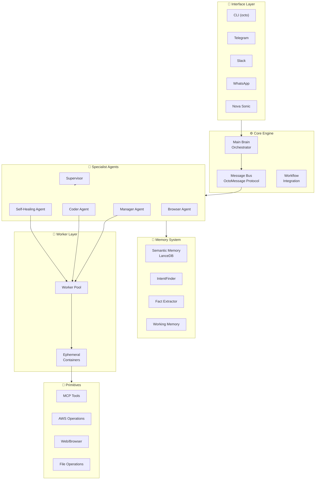
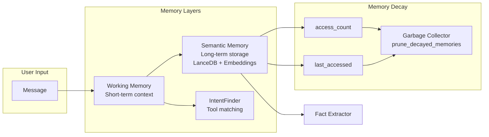
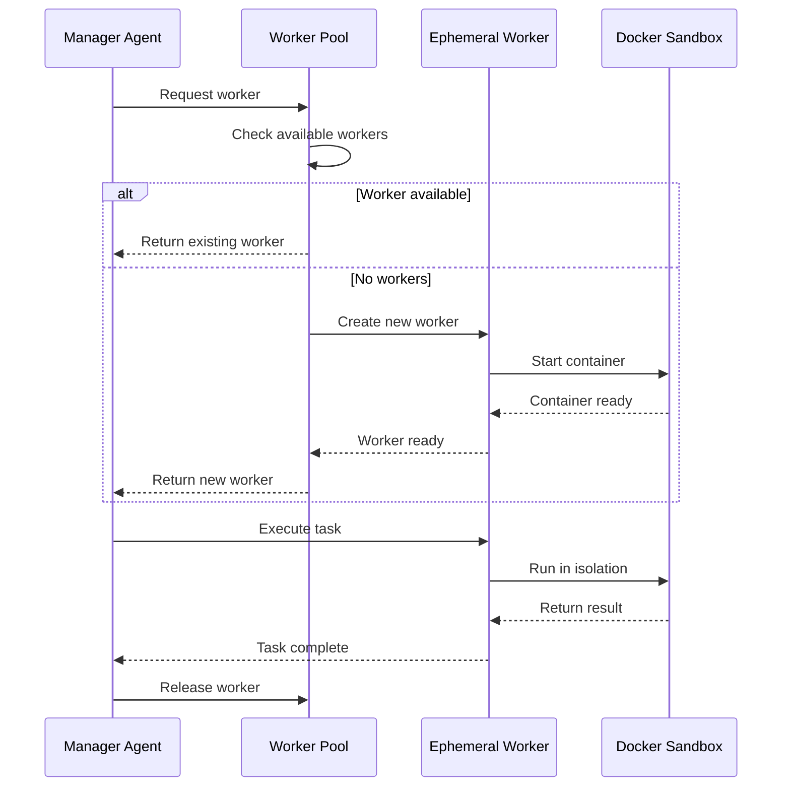
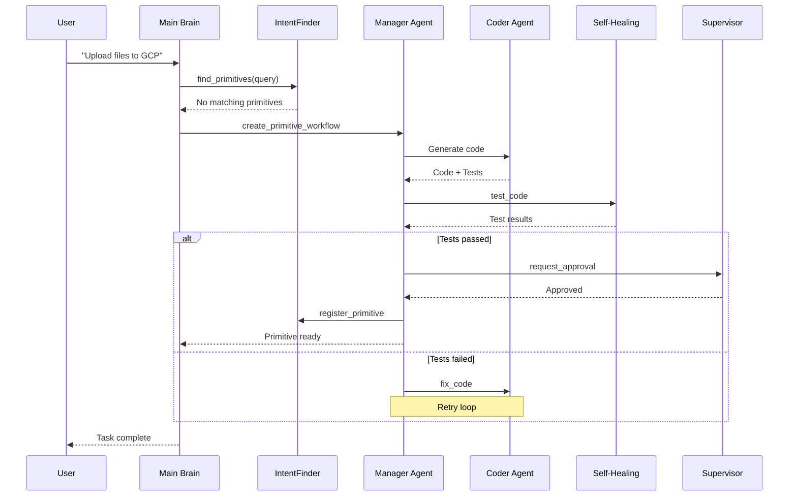
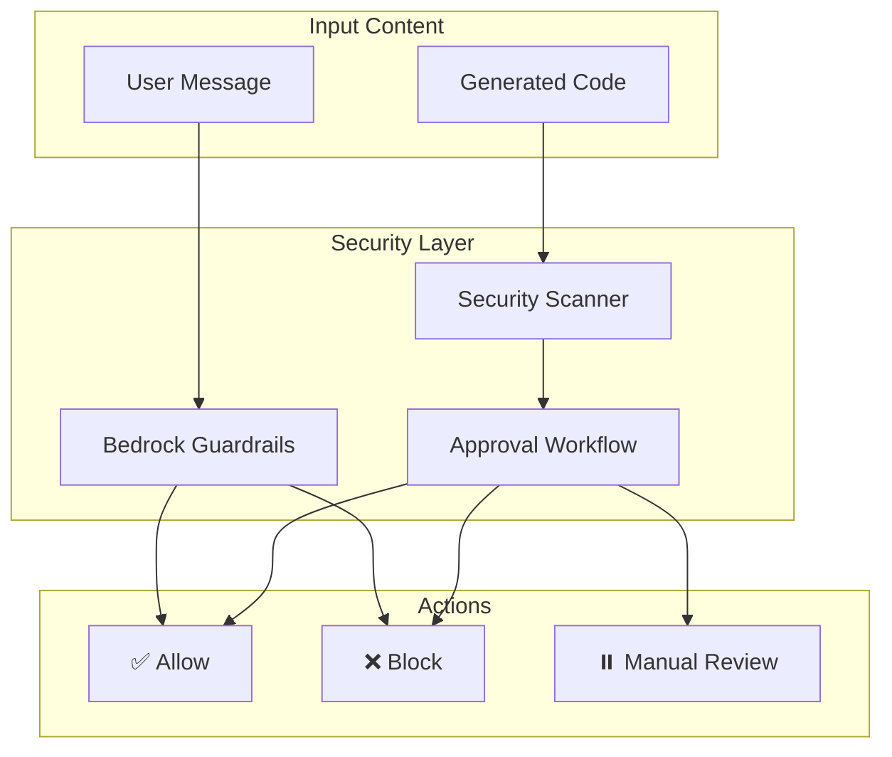

# 🐙 octopOS - AI Agent Operating System

[](https://www.python.org/downloads/)
[](https://opensource.org/licenses/MIT)

> A self-healing, multi-agent AI operating system with episodic memory, tool synthesis, and omni-channel interfaces.

## 🌟 Overview

octopOS is a sophisticated AI agent operating system designed to autonomously handle complex tasks through a coordinated network of specialized agents. It features a unique self-healing capability where the system can generate, test, and deploy new tools (primitives) on-demand when existing capabilities are insufficient.

### Key Features

- **🔧 Self-Healing Architecture**: Automatically generates new tools when needed
- **🧠 Multi-Layer Memory System**: Short-term working memory, long-term semantic memory with decay
- **👥 Multi-Agent Coordination**: Manager, Coder, Self-Healing, and Supervisor agents
- **🐳 Ephemeral Workers**: Docker-based isolated execution environments
- **📱 Omni-Channel**: CLI, Telegram, Slack, WhatsApp, and voice interfaces
- **🛡️ Security-First**: Bedrock Guardrails, code scanning, approval workflows
- **☁️ AWS-Native**: EventBridge, CloudWatch, Bedrock, DynamoDB integration

---

## 🏗️ System Architecture



---

## 📁 Project Structure

```
octopOS/
├── src/
│   ├── engine/              # Core orchestration & messaging
│   │   ├── base_agent.py    # Abstract base for all agents
│   │   ├── orchestrator.py  # Main Brain
│   │   ├── workflow_integration.py  # Complete workflow orchestration
│   │   ├── supervisor.py    # Security & approval
│   │   ├── message.py       # OctoMessage protocol
│   │   └── memory/          # Memory subsystems
│   │       ├── semantic_memory.py    # Long-term memory with decay
│   │       ├── intent_finder.py      # Tool discovery
│   │       ├── fact_extractor.py     # User fact extraction
│   │       └── working_memory.py     # Short-term context
│   │
│   ├── specialist/          # Specialist agents
│   │   ├── manager_agent.py          # Agent coordination
│   │   ├── coder_agent.py            # Code generation
│   │   ├── self_healing_agent.py     # Error recovery
│   │   └── browser_agent.py          # Web automation
│   │
│   ├── workers/             # Ephemeral execution layer
│   │   ├── base_worker.py
│   │   ├── ephemeral_container.py
│   │   └── worker_pool.py
│   │
│   ├── primitives/          # Tool implementations
│   │   ├── base_primitive.py
│   │   ├── tool_registry.py
│   │   ├── mcp_adapter/     # MCP tool integration
│   │   ├── cloud_aws/       # AWS primitives
│   │   ├── web/             # Web scraping & browser
│   │   ├── dev/             # Git & AST operations
│   │   └── native/          # File & bash operations
│   │
│   ├── interfaces/          # User interfaces
│   │   ├── cli/             # Command-line interface
│   │   ├── telegram/        # Telegram bot
│   │   ├── slack/           # Slack integration
│   │   ├── whatsapp/        # WhatsApp Business API
│   │   ├── voice/           # Nova Sonic voice
│   │   └── ui/              # Nova Act UI automation
│   │
│   ├── tasks/               # Task queue & scheduling
│   │   └── task_queue.py    # OctoQueue implementation
│   │
│   └── utils/               # Utilities
│       ├── config.py        # Configuration management
│       ├── bedrock_guardrails.py  # Content safety
│       ├── cloudwatch_logger.py   # AWS logging
│       ├── aws_eventbridge.py     # Serverless scheduling
│       └── token_budget.py        # Cost management
│
├── sandbox/                 # Docker sandbox configuration
├── data/                    # Local data storage
│   └── lancedb/            # Vector database
└── tests/                   # Test suite
```

---

## 🚀 Quick Start

### Prerequisites

- Python 3.11+
- Docker (for sandboxed execution)
- AWS CLI configured (optional, for cloud features)

### Installation

```bash
# Clone the repository
git clone https://github.com/yourusername/octopos.git
cd octopos

# Install dependencies
pip install -e ".[dev]"

# Configure environment
cp .env.example .env
# Edit .env with your settings

# Initialize the system
octo init
```

### Basic Usage

```bash
# Interactive chat
octo chat

# Execute a command
octo ask "List all files in the current directory"

# Check system status
octo status

# Check budget usage
octo budget
```

---

## 🧩 Component Details

### 1. Agent System

| Agent | Role | File |
|-------|------|------|
| **Orchestrator** | Main Brain - coordinates all agents | [`src/engine/orchestrator.py`](src/engine/orchestrator.py) |
| **Manager Agent** | Routes tasks, manages agent lifecycle | [`src/specialist/manager_agent.py`](src/specialist/manager_agent.py) |
| **Coder Agent** | Generates code for new primitives | [`src/specialist/coder_agent.py`](src/specialist/coder_agent.py) |
| **Self-Healing Agent** | Diagnoses and fixes errors | [`src/specialist/self_healing_agent.py`](src/specialist/self_healing_agent.py) |
| **Supervisor** | Security scanning & approval | [`src/engine/supervisor.py`](src/engine/supervisor.py) |
| **Browser Agent** | Web automation & scraping | [`src/specialist/browser_agent.py`](src/specialist/browser_agent.py) |

### 2. Memory System



**Memory Decay Formula:**
```
Importance Score = (access_count * weight) - (days_since_last_access * decay_rate)
```

See: [`src/engine/memory/semantic_memory.py`](src/engine/memory/semantic_memory.py:367)

### 3. Worker System

Ephemeral Docker containers for isolated task execution:



See: [`src/workers/`](src/workers/)

### 4. Workflow Integration

Complete workflow for primitive creation:



See: [`src/engine/workflow_integration.py`](src/engine/workflow_integration.py)

### 5. Security & Guardrails



See: [`src/utils/bedrock_guardrails.py`](src/utils/bedrock_guardrails.py), [`src/engine/supervisor.py`](src/engine/supervisor.py)

---

## 📚 Documentation

- [Architecture Documentation](docs/ARCHITECTURE.md) - Detailed system architecture
- [API Reference](docs/API.md) - API documentation
- [Development Guide](docs/DEVELOPMENT.md) - Contributing guidelines
- [Deployment Guide](docs/DEPLOYMENT.md) - Production deployment

---

## 🧪 Testing

```bash
# Run all tests
pytest

# Run with coverage
pytest --cov=src --cov-report=html

# Run specific test suite
pytest tests/unit/
pytest tests/integration/
```

---

## 📜 License

This project is licensed under the MIT License - see the [LICENSE](LICENSE) file for details.

---

## 🤝 Contributing

Contributions are welcome! Please read our [Contributing Guide](docs/CONTRIBUTING.md) for details.

---

## 🙏 Acknowledgments

- AWS Bedrock for LLM capabilities
- LanceDB for vector storage
- Docker for sandboxed execution
- Model Context Protocol (MCP) for tool integration
