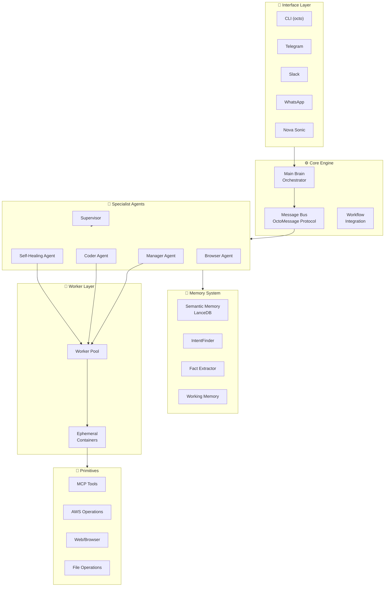
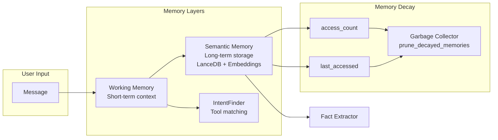
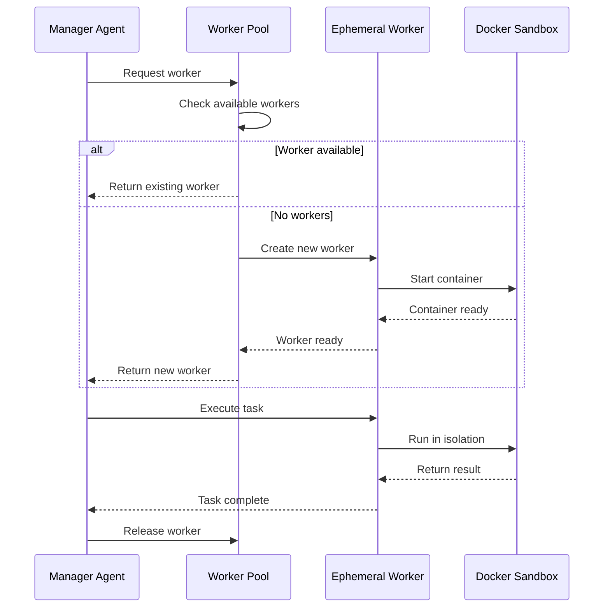
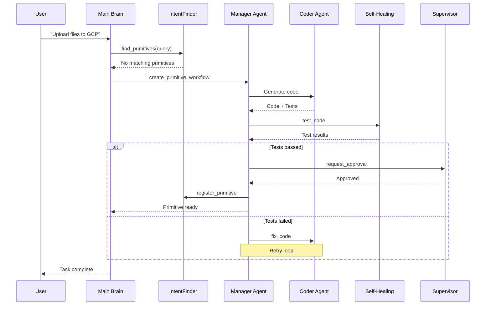
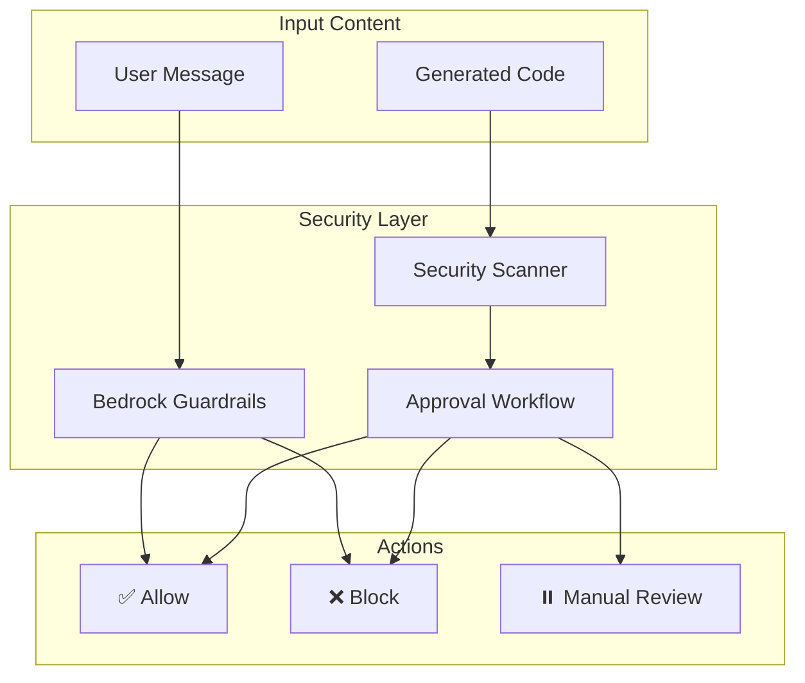

# 🐙 octopOS - AI Agent Operating System

[](https://www.python.org/downloads/)
[](https://opensource.org/licenses/MIT)

> A self-healing, multi-agent AI operating system with episodic memory, tool synthesis, and omni-channel interfaces.

---

## 🌟 Overview

octopOS is a sophisticated AI agent operating system designed to autonomously handle complex tasks through a coordinated network of specialized agents. It features a unique self-healing capability where the system can generate, test, and deploy new tools (primitives) on-demand when existing capabilities are insufficient.

### Key Features

- **🔧 Self-Healing Architecture**: Automatically generates new tools when needed
- **🧠 Multi-Layer Memory System**: Short-term working memory, long-term semantic memory with decay
- **👥 Multi-Agent Coordination**: Manager, Coder, Self-Healing, and Supervisor agents
- **🐳 Ephemeral Workers**: Docker-based isolated execution environments
- **📱 Omni-Channel**: CLI, Telegram, Slack, WhatsApp, and voice interfaces (feature-flagged)
- **🛡️ Security-First**: Bedrock Guardrails, code scanning, approval workflows
- **☁️ AWS-Native**: EventBridge, CloudWatch, Bedrock, DynamoDB integration

---

## 🏗️ System Architecture



---

## 📁 Project Structure

```
octopOS/
├── src/
│   ├── engine/              # Core orchestration & messaging
│   │   ├── base_agent.py    # Abstract base for all agents
│   │   ├── orchestrator.py  # Main Brain
│   │   ├── supervisor.py    # Security & approval
│   │   ├── message.py       # OctoMessage protocol
│   │   └── memory/          # Memory subsystems
│   │       ├── semantic_memory.py
│   │       ├── intent_finder.py
│   │       ├── fact_extractor.py
│   │       └── working_memory.py
│   │
│   ├── specialist/          # Specialist agents
│   │   ├── manager_agent.py
│   │   ├── coder_agent.py
│   │   ├── self_healing_agent.py
│   │   └── browser_agent.py
│   │
│   ├── workers/             # Ephemeral execution layer
│   │   ├── base_worker.py
│   │   ├── ephemeral_container.py
│   │   └── worker_pool.py
│   │
│   ├── primitives/          # Tool implementations
│   │   ├── base_primitive.py
│   │   ├── tool_registry.py
│   │   ├── mcp_adapter/     # MCP tool integration
│   │   ├── cloud_aws/       # AWS primitives
│   │   ├── web/             # Web scraping & browser
│   │   ├── dev/             # Git & AST operations
│   │   └── native/          # File & bash operations
│   │
│   ├── interfaces/          # User interfaces
│   │   ├── cli/             # Command-line interface
│   │   ├── telegram/        # Telegram bot (optional)
│   │   ├── slack/           # Slack integration (optional)
│   │   ├── whatsapp/        # WhatsApp Business API (optional)
│   │   ├── voice/           # Nova Sonic voice (optional)
│   │   └── ui/              # Nova Act UI automation (optional)
│   │
│   ├── tasks/               # Task queue & scheduling
│   │   └── task_queue.py
│   │
│   └── utils/               # Utilities
│       ├── config.py
│       ├── feature_flags.py # Feature flag system
│       ├── bedrock_guardrails.py
│       ├── cloudwatch_logger.py
│       └── token_budget.py
│
├── deploy/                  # Deployment configurations
│   ├── docker-compose.prod.yml
│   └── Dockerfile
│
├── sandbox/                 # Docker sandbox configuration
├── data/                    # Local data storage
└── tests/                   # Test suite
```

---

## 🚀 Quick Start

### Prerequisites

- Python 3.11+
- Docker (for sandboxed execution)
- AWS CLI configured (optional, for cloud features)

### Installation

```bash
# Clone the repository
git clone https://github.com/gnyselcuk/octopos.git
cd octopos

# Install dependencies
pip install -e ".[dev]"

# Configure environment
cp .env.example .env
# Edit .env with your settings

# Run setup wizard
octo setup
```

### Basic Usage

```bash
# Interactive chat
octo chat

# Execute a command
octo ask "List all files in the current directory"

# Check system status
octo agent-status

# Check budget usage
octo budget

# Run Telegram bot polling
export OCTOPOS_FEATURE_TELEGRAM=true
export TELEGRAM_BOT_TOKEN=your_bot_token
octo telegram
```

### Persistent Telegram Service

For a quick local demo, `octo telegram` is enough.

For a server-style setup where users can keep messaging the bot without manually restarting the process, install the Telegram bot as a `systemd` service.

1. Prepare the Telegram service environment file:

```bash
cp deploy/systemd/octopos-telegram.env.example .env.telegram
```

Minimum required values inside `.env.telegram`:

```bash
OCTOPOS_FEATURE_TELEGRAM=true
TELEGRAM_BOT_TOKEN=your_bot_token
TELEGRAM_ALLOWED_CHAT_IDS=123456789
```

Optional values:

```bash
TELEGRAM_CHAT_ID=123456789
AWS_REGION=us-east-1
AWS_PROFILE=default
```

2. Install the service.

For a real server or VM, prefer a system service:

```bash
sudo ./deploy/scripts/install-telegram-service.sh --system
```

If `sudo` is not available or you only need a demo on your own machine, use a user service:

```bash
./deploy/scripts/install-telegram-service.sh --user
```

3. Verify the service:

```bash
systemctl --user status octopos-telegram
journalctl --user -u octopos-telegram -f
```

For system mode:

```bash
sudo systemctl status octopos-telegram
sudo journalctl -u octopos-telegram -f
```

Important notes:

- `TELEGRAM_ALLOWED_CHAT_IDS` is the safety gate. Only those chats can use the bot.
- `--system` is the correct mode for a persistent server deployment.
- `--user` is useful for demos, but may stop working after logout or reboot.
- If you use `--user` and want it to survive logout, enable linger for that user.

Useful service commands:

```bash
sudo systemctl status octopos-telegram
sudo systemctl restart octopos-telegram
sudo journalctl -u octopos-telegram -f
```

---

## 🎛️ Feature Flags

octopOS uses feature flags to enable/disable optional components:

| Feature | Environment Variable | Default |
|---------|---------------------|---------|
| Slack | `OCTOPOS_FEATURE_SLACK` | `false` |
| WhatsApp | `OCTOPOS_FEATURE_WHATSAPP` | `false` |
| Telegram | `OCTOPOS_FEATURE_TELEGRAM` | `false` |
| Nova Act | `OCTOPOS_FEATURE_NOVA_ACT` | `false` |
| Nova Sonic | `OCTOPOS_FEATURE_NOVA_SONIC` | `false` |

Enable a feature:
```bash
export OCTOPOS_FEATURE_NOVA_ACT=true
octo browse "search for something"
```

---

## 🧩 Component Details

### 1. Agent System

| Agent | Role | File |
|-------|------|------|
| **Orchestrator** | Main Brain - coordinates all agents | [`src/engine/orchestrator.py`](src/engine/orchestrator.py) |
| **Manager Agent** | Routes tasks, manages agent lifecycle | [`src/specialist/manager_agent.py`](src/specialist/manager_agent.py) |
| **Coder Agent** | Generates code for new primitives | [`src/specialist/coder_agent.py`](src/specialist/coder_agent.py) |
| **Self-Healing Agent** | Diagnoses and fixes errors | [`src/specialist/self_healing_agent.py`](src/specialist/self_healing_agent.py) |
| **Supervisor** | Security scanning & approval | [`src/engine/supervisor.py`](src/engine/supervisor.py) |
| **Browser Agent** | Web automation & scraping | [`src/specialist/browser_agent.py`](src/specialist/browser_agent.py) |

### 2. Memory System



**Memory Decay Formula:**
```
Importance Score = (access_count * weight) - (days_since_last_access * decay_rate)
```

### 3. Worker System

Ephemeral Docker containers for isolated task execution:



### 4. Workflow Integration

Complete workflow for primitive creation:



### 5. Security & Guardrails



---

## 🐳 Deployment

### Docker Compose (Production)

```bash
# Start services
cd deploy
docker-compose -f docker-compose.prod.yml up -d

# View logs
docker-compose -f docker-compose.prod.yml logs -f

# Stop services
docker-compose -f docker-compose.prod.yml down
```

### Environment Variables

See [`.env.example`](.env.example) for all available configuration options.

Key variables:
- `AWS_REGION` - AWS region for Bedrock
- `OCTO_AGENT_NAME` - Agent name
- `OCTO_AGENT_PERSONA` - Agent personality (friendly/professional/technical)
- `LOG_LEVEL` - Logging level (DEBUG/INFO/WARNING/ERROR)

### Telegram As A Service

Production recommendation for Telegram access:

1. Keep the repo checked out on the host.
2. Create `.env.telegram` from `deploy/systemd/octopos-telegram.env.example`.
3. Set `TELEGRAM_BOT_TOKEN` and `TELEGRAM_ALLOWED_CHAT_IDS`.
4. Install with `./deploy/scripts/install-telegram-service.sh --system`.
5. Monitor with `systemctl` and `journalctl`.

This gives you:

- automatic restart on failure
- startup on boot
- no need to keep an interactive shell open
- Telegram access restricted to approved chat IDs

---

## 🧪 Testing

```bash
# Run all tests
pytest

# Run with coverage
pytest --cov=src --cov-report=html

# Run specific test suite
pytest tests/unit/
pytest tests/integration/
```

---

## 🛠️ Development

### Pre-commit Hooks

```bash
# Install pre-commit
pip install pre-commit
pre-commit install

# Run manually
pre-commit run --all-files
```

### Creating a Custom Primitive

```python
from src.primitives.base_primitive import BasePrimitive, PrimitiveResult

class MyTool(BasePrimitive):
    @property
    def name(self) -> str:
        return "my_tool"

    @property
    def description(self) -> str:
        return "Does something useful"

    async def execute(self, **params) -> PrimitiveResult:
        # Implementation
        return PrimitiveResult(
            success=True,
            data={"result": "done"},
            message="Success"
        )
```

---

## 📚 Additional Documentation

- [Architecture Plan](architecture_plan.md) - System architecture and design decisions
- [Architecture Supplement](architecture_supplement.md) - Additional architectural details

---

## 📜 License

This project is licensed under the MIT License - see the [LICENSE](LICENSE) file for details.

---

## 🤝 Contributing

Contributions are welcome! Please ensure:
1. Code follows the existing style (use pre-commit hooks)
2. Tests pass (`pytest`)
3. Documentation is updated for any changes

---

## 🙏 Acknowledgments

- AWS Bedrock for LLM capabilities
- LanceDB for vector storage
- Docker for sandboxed execution
- Model Context Protocol (MCP) for tool integration
