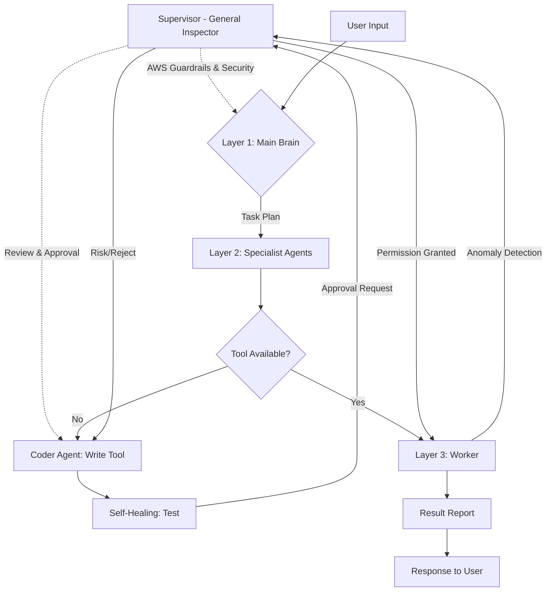

# octopOS - Agentic OS Architecture and Roadmap

## 1. Vision and Goals

**octopOS** is a lightweight, fast, and highly autonomous "Agentic OS" (Agent Operating System) project based on AWS's latest **Nova** model series. As an alternative to heavy systems like OpenDevin, it aims to be a modular structure that can write its own tools (primitives), perform error management (self-healing), and evolve dynamically.

### Core Principles

- **Lightweight:** Serverless architecture and local database usage.
- **Speed:** Asynchronous structure and optimized intent capture (intent finder).
- **Security:** Sandbox (Docker) isolation and principle of least privilege.
- **AWS Compatibility:** Native integration with Bedrock and AWS resources.
- **Evolutionary Structure:** A dynamic system that can write and test its own missing tools.

---

## 2. Technology Stack

- **Language:** Python 3.10+ (Asynchronous-focused)
- **AI Models (AWS Bedrock):**
  - **Nova 2 Lite / Pro:** Strategy and Planning Engine.
  - **Nova Act:** UI/Workflow automation and multimodal operations.
  - **Nova Sonic:** Voice interaction (Speech-to-Speech).
  - **Nova Multimodal Embeddings:** Vector-based information management (LanceDB).
- **Vector Database:** **LanceDB** (Serverless, local, fast).
- **CLI/Interface:** **Typer** or Click.
- **Isolation:** Docker / Ephemeral Containers.

---

## 3. Four-Tier System Architecture (4-Tier Hierarchy)

The hierarchical structure that manages the system's "legal", "strategic", "expertise", and "execution" processes:

### A. Workflow and Control Diagram (Mermaid)



### B. Layer Details

1. **Layer 0: Supervisor (General Inspector):**
    - **Legal & Security:** The inspection layer above all agents in the system.
    - **AWS Integration:** Monitors harmful content with Bedrock **Guardrails** and anomalies with **CloudWatch**.
    - **Approval Mechanism:** Approves whether new tools (primitives) written by the Coder Agent are "safe" before being included in the system.

2. **Layer 1: Main Brain (Orchestrator):**
    - **Strategy:** Analyzes user intent, breaks down projects into subtasks, and triggers appropriate specialist agents.

3. **Layer 2: Specialist Agents (Experts):**
    - **Coder Agent:** Writes new `primitive` tools.
    - **Self-Healing Agent:** Debugs code errors and improves the working environment (sandbox).
    - **Manager Agent:** Coordinates data flow between other specialists.

4. **Layer 3: Workers & Primitives (Executors):**
    - **High Isolation:** "Ephemeral" agents that work in Docker, do only the given task, and then self-destruct.
    - **Input/Output Focused:** Stateless operation.

---

## 4. Intent Capture and Dynamic Tool Workflow

The system's "intelligent" intent capture and new tool development cycle works with the following logic:

1. **Classification:** Input is parsed as either "Chat" or "Operational Task".
2. **Vector Search (LanceDB):** For task-based requests, candidates semantically closest to all `primitive` documentations are selected.
3. **Candidate Selection:** Only the top 3-5 most relevant tools are presented to the LLM (Cost and Speed optimization).
4. **Dynamic Tooling (If Tool Doesn't Exist):** Coder Agent writes -> Self-Healing tests -> Supervisor approves -> Added to LanceDB.

---

## 5. Communication and Messaging Protocol (OctoMessage)

All agents and inspectors in the system communicate in JSON format over an asynchronous "OctoMessage" protocol. This structure is validated with Pydantic models.

### A. Standard Message Structure (OctoMessage)

```json
{
  "message_id": "uuid-12345",
  "sender": "MainBrain",
  "receiver": "CoderAgent",
  "type": "TASK", 
  "payload": {
    "action": "create_primitive",
    "params": {
      "name": "S3Uploader",
      "description": "Uploads files to AWS S3"
    },
    "context": {
        "workspace_path": "/sandbox/project_alpha",
        "aws_region": "us-east-1"
    }
  },
  "timestamp": "2026-03-02T15:30:00Z"
}
```

### B. Error and Approval Mechanisms

- **Error (ERROR):** When a worker or agent encounters an error, it returns a message containing `error_type` and `suggestion` (solution proposal). This message is caught by the **Self-Healing Agent**.
- **Approval (APPROVAL_REQUEST):** New tools written by the Coder Agent are sent to the **Supervisor** (Inspector) layer along with `security_scan` (security scan) results.

### C. State Management

- **Hierarchical State:** While Workers operate statelessly, Specialist Agents and Main Brain maintain context throughout the session.
- **Secure Logging:** All actions are kept "Traceable" (traceable) with CloudWatch and local log mechanisms.

---

## 7. Setup and Personalization

The system's initial setup (Onboarding) is a process that determines both technical security and the agent's "personality".

### A. Setup Flow (`octo setup`)

1. **Environment Discovery:** The application automatically detects whether it is running on a local machine or an AWS resource (EC2/ECS). Prioritizes IAM Roles in cloud environments.
2. **AWS Authorization:** STS (Security Token Service) based temporary key mechanism is configured.
3. **Agent Identity Definition:**
    - **Agent Name & Persona:** The agent's name and communication style (e.g., Friendly, Professional, Technical).
    - **Language and Location:** Default communication language and timezone settings.
4. **User Definition:** The user's name, preferred working directory, and frequently used AWS services.

### B. Personality and Memory (Persona Profile)

Each agent is fed from a profile file stored under `src/engine/profiles/`. This profile dynamically builds the **System Prompt** sent to Nova models:

- `"Your name is octoOS, your user calls you buddy. Give technical and fast answers."`

---

## 10. Omni-Channel Communication

octoOS can receive commands and present reports not only via terminal (CLI) but also through modern communication platforms.

### A. Interface Gateways

- **CLI Interface:** Primary interface for main management and local file operations.
- **Telegram/Slack/WhatsApp:** Used for remote control, quick status reports, and file sharing.
- **MessageAdapter:** The adapter layer that converts data (voice, text, file) from different platforms into the standard `OctoMessage` format.

### B. Remote File and Information Management

When the user sends files (PDF, Image, Log) to the agent through these channels:

1. The file is analyzed with **Nova Multimodal Embeddings**.
2. Data is processed vectorially into **LanceDB**.
3. The agent instantly adds any document sent to its "memory" (context).

## 11. Task Management and Scheduling

octoOS has an advanced queue and scheduling engine for managing long-term and periodic tasks.

### A. Task Types

- **One-off Tasks (Instant):** Tasks that start immediately and continue in the background (e.g., "Write code", "Create article").
- **Recurring Tasks (Periodic):** Jobs that repeat at specific time intervals (e.g., "Send report every morning", "Check logs every hour").

### B. Scheduler and Queue (The OctoQueue)

1. **Memory and Persistence:** All tasks are stored in a task database. When `Main Brain` understands that a task is periodic, it registers it with the scheduler.
2. **Asynchronous Continuity:** Long-running tasks (like writing a book) do not block main communication. The user can continue chatting with the system and add new tasks.
3. **Status Check:** The user gets an instant progress report (percentage and stage-based) with the `octo status` command or natural language questions like "What's the status of the book?".
4. **AWS Integration:** In cloud-based deployments, **AWS EventBridge** is used to provide system-independent periodic triggers (Serverless Cron).

---

## 12. Memory and Context Management

octopOS has a hybrid memory structure that recognizes the user and doesn't forget the past.

### A. Memory Layers

- **Short-term Memory (Working Memory):** Holds the current session's dialogue flow and instant variables. Ensures dialogue fluidity.
- **Long-term Memory (Semantic Memory):** Stores important information from past sessions, user preferences, and "Important Facts". Queryable vectorially via **LanceDB**.

### B. Fact Extraction

The system automatically detects critical information about the user during dialogues:

1. **Detection:** "I live in Istanbul."
2. **Extraction:** Information is parsed as (Location: Istanbul).
3. **Permanent Record:** Processed into the user profile (User Persona). This way, the agent can establish personal contexts like "The weather is sunny in Istanbul today, buddy" even weeks later.

### C. Memory Decay / Synaptic Pruning

A long-term memory optimization mechanism inspired by the principles of neuroplasticity and synaptic pruning in the human brain. The goal is to prevent the database from bloating with unnecessary information and slowing down, ensuring that only "truly frequently used" information remains permanent.

1. **Reinforcement:** Each time information is recalled from memory, its `access_count` value is incremented and the `last_accessed` timestamp is updated (like thickening neural connections).
2. **Salience Score:** Each piece of information has a mathematical importance score: `(access_count * weight) - (days_elapsed * decay_rate)`.
3. **Pruning:** A Garbage Collector running in the background deletes memories whose score falls below a certain threshold (long unused and rarely recalled) from the database, keeping the system always optimized.

---

## 13. Folder Structure (Final Architecture - V5)

```text
octopos/
├── src/
│   ├── engine/           
│   │   ├── orchestrator.py  # Main Brain
│   │   ├── supervisor.py    # Inspector
│   │   ├── scheduler.py     # Scheduling
│   │   ├── memory/          # Short-term & Long-term Memory
│   │   └── profiles/        # Persona & Memory snapshots
│   ├── specialist/       # Coder, Self-Healing, etc.
│   ├── interfaces/       # CLI, Telegram, Slack, WhatsApp Gateways
│   ├── primitives/       # Modular tools
│   ├── tasks/            # Task queue and status management
│   └── utils/            # AWS STS, LanceDB, Logger
├── sandbox/              # Docker Workspace
├── .env                  # API Keys & Credentials
└── pyproject.toml        # Dependencies
```

---

## 14. Implementation Roadmap (Final Milestone)

1. **Phase 1 (Foundation):** CLI, BaseAgent, and AWS Authorization (STS) skeleton.
2. **Phase 2 (Specialization):** Coder Agent with "Dynamic Tool" writing cycle.
3. **Phase 3 (Memory & Intelligence):** LanceDB, Intent Finder, and Long-term Memory (Fact Extraction).
4. **Phase 4 (Omni-Channel & Tasking):** Telegram/Slack integration and Background Task Queue.
5. **Phase 5 (Scheduling & Voice):** Periodic tasks (Cron), Nova Sonic (Voice), and Nova Act (UI) integration.
