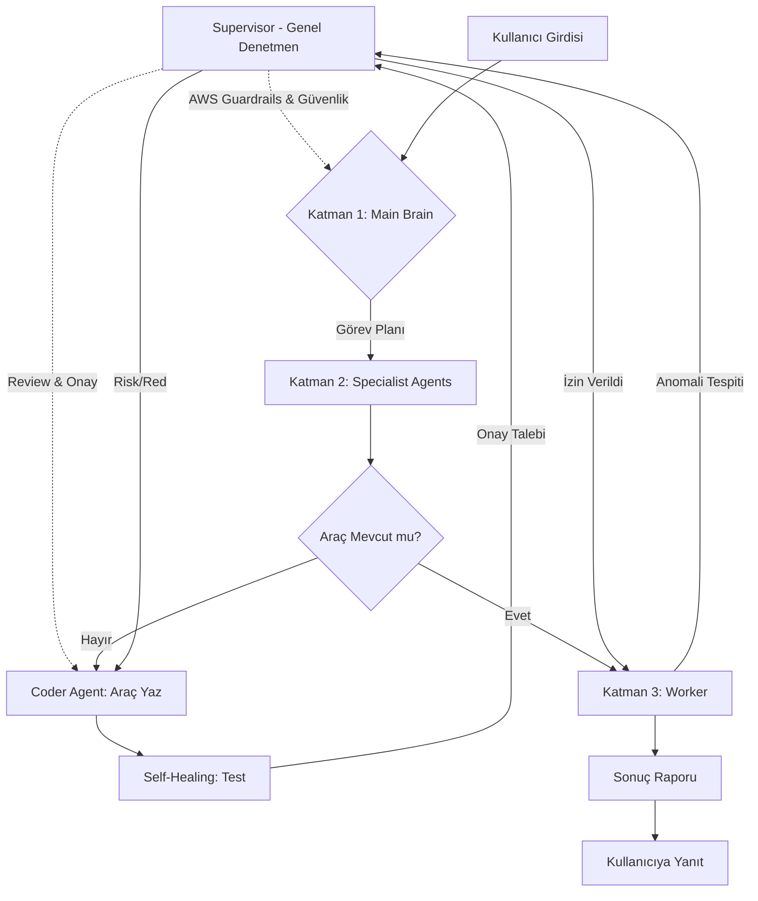

# octopOS - Agentic OS Mimari ve Yol Haritası

## 1. Vizyon ve Hedefler

**octopOS**, AWS'nin en yeni **Nova** model serisini temel alan, hafif, hızlı ve yüksek seviyede otonom bir "Agentic OS" (Ajan İşletim Sistemi) projesidir. OpenDevin gibi ağır sistemlere alternatif olarak, kendi araçlarını (primitives) yazabilen, hata yönetimi yapabilen (self-healing) ve modüler bir yapı hedeflenmektedir.

### Temel Prensipler

- **Hafiflik:** Serverless mimari ve yerel veritabanı kullanımı.
- **Hız:** Asenkron yapı ve optimize edilmiş niyet yakalama (intent finder).
- **Güvenlik:** Sandbox (Docker) izolasyonu ve kısıtlı yetki prensibi.
- **AWS Uyumluluğu:** Bedrock ve AWS kaynakları ile yerel entegrasyon.
- **Evrimsel Yapı:** Eksik araçları kendi yazabilen ve test edebilen dinamik sistem.

---

## 2. Teknoloji Yığını (Tech Stack)

- **Dil:** Python 3.10+ (Asenkron odaklı)
- **AI Modelleri (AWS Bedrock):**
  - **Nova 2 Lite / Pro:** Strateji ve Planlama Motoru.
  - **Nova Act:** UI/Workflow otomasyonu ve multimodal işlemler.
  - **Nova Sonic:** Sesli etkileşim (Speech-to-Speech).
  - **Nova Multimodal Embeddings:** Vektörel bilgi yönetimi (LanceDB).
- **Vektör Veritabanı:** **LanceDB** (Serverless, local, hızlı).
- **CLI/Arayüz:** **Typer** veya Click.
- **İzolasyon:** Docker / Ephemeral Containers.

---

## 3. Dört Katlı Sistem Mimarisi (4-Tier Hierarchy)

Sistemin "hukuk", "strateji", "uzmanlık" ve "icra" süreçlerini yöneten hiyerarşik yapısı:

### A. İş Akışı ve Denetim Diyagramı (Mermaid)



### B. Katman Detayları

1. **Katman 0: Supervisor (Genel Denetmen):**
    - **Hukuk & Güvenlik:** Sistemdeki tüm ajanların üstünde yer alan denetim katmanıdır.
    - **AWS Entegrasyonu:** Bedrock **Guardrails** ile zararlı içerikleri, **CloudWatch** ile anomalileri izler.
    - **Onay Mekanizması:** Coder Agent'ın yazdığı yeni araçların (primitives) sisteme dahil edilmeden önce "güvenli" olup olmadığını onaylar.

2. **Katman 1: Main Brain (Orkestra Şefi):**
    - **Strateji:** Kullanıcı niyetini (Intent) analiz eder, projeyi alt görevlere böler ve uygun uzman ajanları tetikler.

3. **Katman 2: Specialist Agents (Uzmanlar):**
    - **Coder Agent:** Yeni `primitive` araçları yazar.
    - **Self-Healing Agent:** Kod hatalarını ayıklar ve çalışma ortamını (sandbox) iyileştirir.
    - **Manager Agent:** Diğer uzmanlar arası veri akışını koordine eder.

4. **Katman 3: Workers & Primitives (Uygulayıcılar):**
    - **Yüksek İzolasyon:** Docker içinde sadece verilen işi yapıp kendini yok eden "ephemeral" ajanlardır.
    - **Girdi/Çıktı Odaklı:** Stateless (durumsuz) çalışırlar.

---

## 4. Niyet Yakalama ve Dinamik Araç İş Akışı

Sistemin "akıllı" niyet yakalama ve yeni araç geliştirme döngüsü aşağıdaki mantıkla çalışır:

1. **Sınıflandırma:** Girdi "Sohbet" mi yoksa "Operasyonel Görev" mi ayrıştırılır.
2. **Vektörel Arama (LanceDB):** Görevsel isteklerde, tüm `primitive` dokümantasyonları arasından semantik olarak en yakın adaylar seçilir.
3. **Candidate Selection:** LLM'e sadece en alakalı ilk 3-5 araç sunulur (Maliyet ve Hız optimizasyonu).
4. **Dynamic Tooling (Araç Yoksa):** Coder Agent yazar -> Self-Healing test eder -> Supervisor onaylar -> LanceDB'ye eklenir.

---

## 5. İletişim ve Mesajlaşma Protokolü (OctoMessage)

Sistemdeki tüm ajanlar ve denetmenler, asenkron bir "OctoMessage" protokolü üzerinden JSON formatında haberleşir. Bu yapı, Pydantic modelleri ile doğrulanır.

### A. Standart Mesaj Yapısı (OctoMessage)

```json
{
  "message_id": "uuid-12345",
  "sender": "MainBrain",
  "receiver": "CoderAgent",
  "type": "TASK", 
  "payload": {
    "action": "create_primitive",
    "params": {
      "name": "S3Uploader",
      "description": "Uploads files to AWS S3"
    },
    "context": {
        "workspace_path": "/sandbox/project_alpha",
        "aws_region": "us-east-1"
    }
  },
  "timestamp": "2026-03-02T15:30:00Z"
}
```

### B. Hata ve Onay Mekanizmaları

- **Hata (ERROR):** Bir worker veya ajan hata aldığında, `error_type` ve `suggestion` (çözüm önerisi) içeren bir mesaj döner. Bu mesaj **Self-Healing Agent** tarafından yakalanır.
- **Onay (APPROVAL_REQUEST):** Coder Agent tarafından yazılan yeni araçlar, **Supervisor** (Denetmen) katmanına `security_scan` (güvenlik taraması) sonuçlarıyla birlikte gönderilir.

### C. State Yönetimi

- **Hiyerarşik State:** Workers stateless (durumsuz) çalışırken, Specialist Agents ve Main Brain oturum boyunca bağlamı (context) korur.
- **Güvenli Kayıt:** Tüm aksiyonlar CloudWatch ve yerel log mekanizmalarıyla "Traceable" (izlenebilir) tutulur.

---

## 7. Kurulum ve Kişiselleştirme (Setup & Personalization)

Sistemin ilk kurulumu (Onboarding), hem teknik güvenliği hem de ajanın "kişiliğini" belirleyen bir süreçtir.

### A. Kurulum Akışı (`octo setup`)

1. **Bağlam Tespiti (Environment Discovery):** Uygulama, yerel makinede mi yoksa bir AWS kaynağında (EC2/ECS) mı çalıştığını otomatik algılar. Cloud ortamında IAM Role'lerini önceliklendirir.
2. **AWS Yetkilendirme:** STS (Security Token Service) tabanlı geçici anahtar mekanizması yapılandırılır.
3. **Ajan Kimlik Tanımı:**
    - **Ajan Adı & Persona:** Ajanın ismi ve konuşma tarzı (örn: Dostane, Profesyonel, Teknik).
    - **Dil ve Lokasyon:** Varsayılan iletişim dili ve zaman dilimi ayarları.
4. **Kullanıcı Tanımı:** Kullanıcının adı, tercih ettiği çalışma dizini ve sık kullandığı AWS servisleri.

### B. Kişilik ve Hafıza (Persona Profile)

Her ajan, `src/engine/profiles/` altında saklanan bir profil dosyasından beslenir. Bu profil, Nova modellerine gönderilen **System Prompt**'u dinamik olarak inşa eder:

- `"Senin adın octoOS, kullanıcın kanka diye hitap ediyor. Teknik ve hızlı cevaplar ver."`

---

## 10. Çok Kanallı İletişim (Omni-Channel Interface)

octoOS, sadece terminal (CLI) üzerinden değil, modern iletişim platformları üzerinden de emir alabilir ve rapor sunabilir.

### A. Interface Gateways (Arayüz Geçitleri)

- **CLI Interface:** Ana yönetim ve yerel dosya operasyonları için birincil arayüz.
- **Telegram/Slack/WhatsApp:** Uzaktan kontrol, hızlı durum raporları ve dosya paylaşımı için kullanılır.
- **MessageAdapter:** Farklı platformlardan gelen veriyi (ses, metin, dosya) standart `OctoMessage` formatına dönüştüren adaptör katmanıdır.

### B. Uzaktan Dosya ve Bilgi Yönetimi

Kullanıcı bu kanallar üzerinden ajana dosya (PDF, Görsel, Log) gönderdiğinde:

1. Dosya, **Nova Multimodal Embeddings** ile analiz edilir.
2. Veriler **LanceDB**'ye vektörel olarak işlenir.
3. Ajan, gönderilen her türlü dökümanı anlık "hafızasına" (context) ekler.

## 11. Görev Yönetimi ve Zamanlama (Task & Scheduling)

octoOS, uzun süreli ve periyodik görevleri yönetmek için gelişmiş bir kuyruk ve zamanlama motoruna sahiptir.

### A. Görev Tipleri

- **One-off Tasks (Anlık):** Hemen başlatılan ve arka planda devam eden görevler (örn: "Kod yaz", "Makale oluştur").
- **Recurring Tasks (Periyodik):** Belirli zaman aralıklarıyla tekrarlanan işler (örn: "Her sabah rapor gönder", "Her saat başı log kontrolü yap").

### B. Zamanlayıcı ve Kuyruk (The OctoQueue)

1. **Hafıza ve Kalıcılık:** Tüm görevler bir görev veritabanında saklanır. `Main Brain`, bir görevin periyodik olduğunu anladığında onu zamanlayıcıya (Scheduler) kaydeder.
2. **Asenkron Devamlılık:** Uzun süren görevler (kitap yazmak gibi) ana iletişimi engellemez. Kullanıcı sistemle sohbet etmeye devam edebilir, yeni görevler ekleyebilir.
3. **Status Check:** Kullanıcı `octo status` komutuyla veya doğal dille "Kitap ne durumda?" sorusuna anlık ilerleme (yüzde ve aşama bazlı) raporu alır.
4. **AWS Entegrasyonu:** Bulut tabanlı dağıtımlarda **AWS EventBridge** kullanılarak sistem bağımsız periyodik tetiklemeler (Serverless Cron) sağlanır.

---

## 12. Hafıza ve Bağlam Yönetimi (Memory & Context)

octoOS, kullanıcıyı tanıyan ve geçmişi unutmayan hibrit bir hafıza yapısına sahiptir.

### A. Hafıza Katmanları

- **Kısa Süreli Hafıza (Working Memory):** Mevcut oturumdaki diyalog akışını ve anlık değişkenleri tutar. Diyalog akıcılığını sağlar.
- **Uzun Süreli Hafıza (Semantic Memory):** Geçmiş oturumlardaki önemli bilgileri, kullanıcı tercihlerini ve "Önemli Gerçekleri" (Facts) saklar. **LanceDB** üzerinden vektörel olarak sorgulanır.

### B. Bilgi Çıkarma (Fact Extraction)

Sistem, diyaloglar sırasında kullanıcıya dair kritik bilgileri otomatik olarak tespit eder:

1. **Tespit:** "Ben İstanbul'da yaşıyorum."
2. **Çıkarma:** Bilgi (Location: Istanbul) olarak ayrıştırılır.
3. **Kalıcı Kayıt:** Kullanıcı profiline (User Persona) işlenir. Bu sayede ajan, haftalar sonra bile "İstanbul'da hava bugün güneşli kanka" gibi kişisel bağlamlar kurabilir.

### C. Hafıza Çürümesi (Memory Decay / Synaptic Pruning)

İnsan beynindeki nöroplastisite ve sinaptik budanma (synaptic pruning) ilkelerinden ilham alınarak geliştirilmiş bir uzun süreli hafıza optimizasyonu mekanizmasıdır. Amaç, veritabanının gereksiz bilgilerle şişmesini ve yavaşlamasını önlemek, sadece "gerçekten sık kullanılan" bilgilerin kalıcı olmasını sağlamaktır.

1. **Reinforcement (Pekiştirme):** Bir bilgi hafızadan her çağrıldığında (recall), o bilginin `access_count` değeri artırılır ve `last_accessed` zaman damgası güncellenir (tıpkı kalınlaşan nöral bağlar gibi).
2. **Önem Skoru (Salience):** Her bilginin matematiksel bir önem skoru vardır: `(access_count * ağırlık) - (geçen_gün_sayısı * çürüme_hızı)`.
3. **Pruning (Budama):** Arka planda çalışan çöp toplayıcı (Garbage Collector), skoru belirli bir eşiğin altına düşen (uzun süredir kullanılmayan ve az çağrılmış) anıları veritabanından silerek sistemi her zaman optimize tutar.

---

## 13. Klasör Yapısı (Final Architecture - V5)

```text
octopos/
├── src/
│   ├── engine/           
│   │   ├── orchestrator.py  # Main Brain
│   │   ├── supervisor.py    # Denetmen
│   │   ├── scheduler.py     # Zamanlama
│   │   ├── memory/          # Short-term & Long-term Memory
│   │   └── profiles/        # Persona & Memory snapshotları
│   ├── specialist/       # Coder, Self-Healing, vb.
│   ├── interfaces/       # CLI, Telegram, Slack, WhatsApp Gateways
│   ├── primitives/       # Modüler araçlar
│   ├── tasks/            # Görev kuyruğu ve durum yönetimi
│   └── utils/            # AWS STS, LanceDB, Logger
├── sandbox/              # Docker Workspace
├── .env                  # API Keys & Credentials
└── pyproject.toml        # Bağımlılıklar
```

---

## 14. Uygulama Yol Haritası (Final Milestone)

1. **Aşama 1 (Foundation):** CLI, BaseAgent ve AWS Yetkilendirme (STS) iskeleti.
2. **Aşama 2 (Specialization):** Coder Agent ile "Dinamik Araç" yazma döngüsü.
3. **Aşama 3 (Memory & Intelligence):** LanceDB, Intent Finder ve Uzun Süreli Hafıza (Fact Extraction).
4. **Aşama 4 (Omni-Channel & Tasking):** Telegram/Slack entegrasyonu ve Arka Plan Görev Kuyruğu.
5. **Aşama 5 (Scheduling & Voice):** Periyodik görevler (Cron), Nova Sonic (Ses) ve Nova Act (UI) entegrasyonu.
