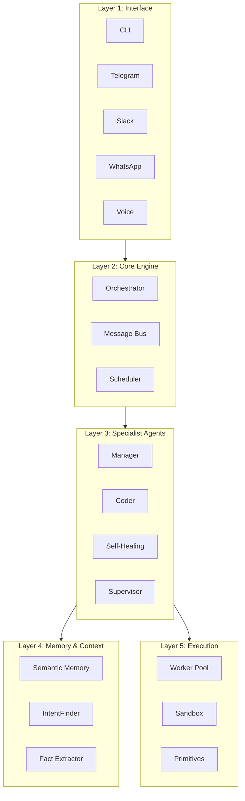
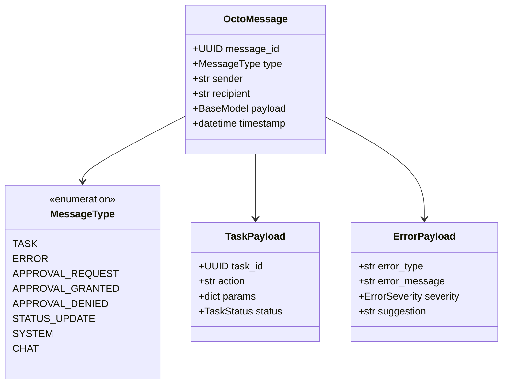
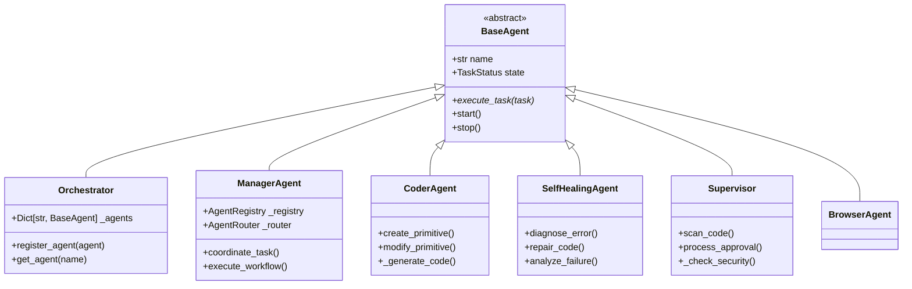
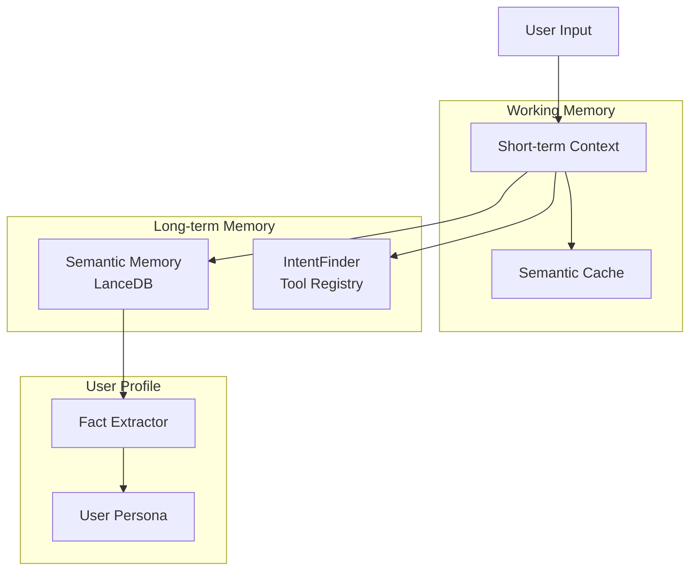
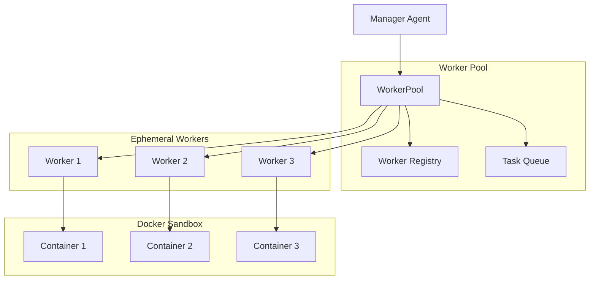
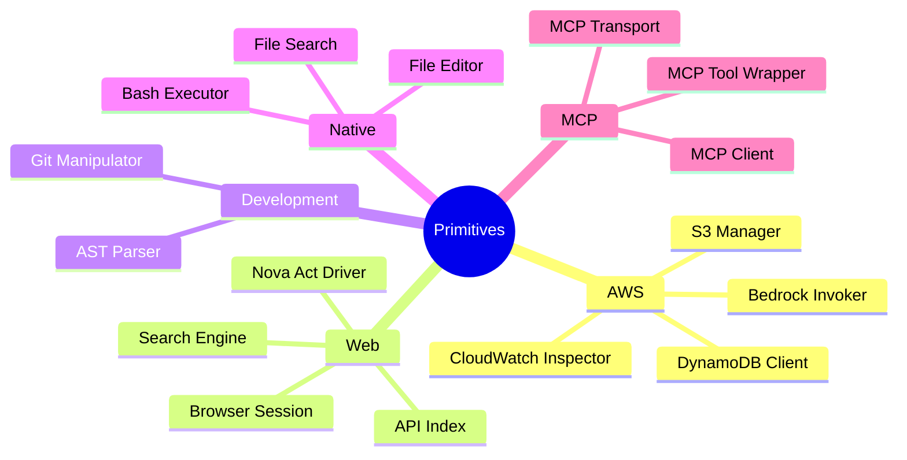
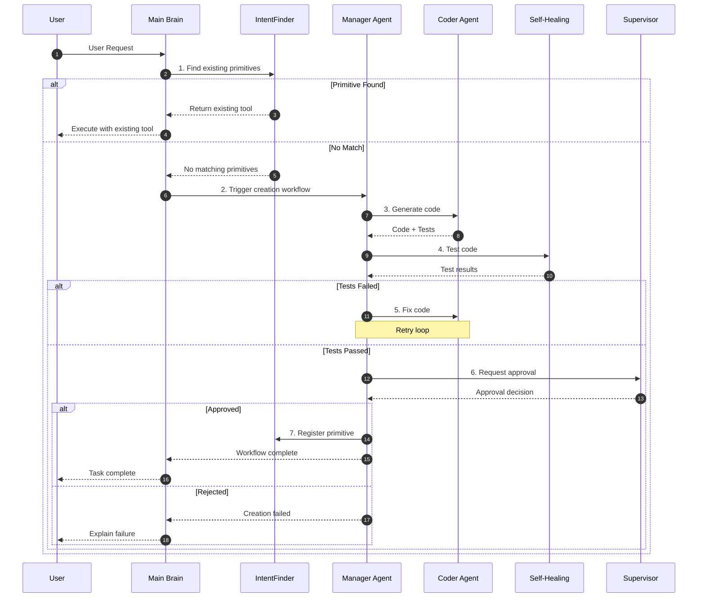
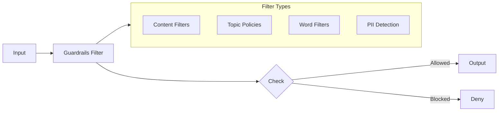
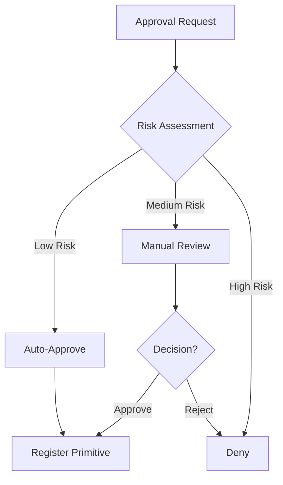
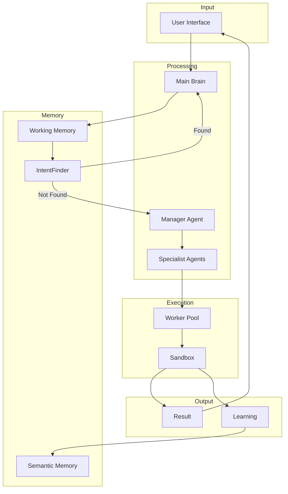

# octopOS Architecture Documentation

This document provides a comprehensive technical overview of the octopOS architecture, based on the actual implementation in the codebase.

---

## Table of Contents

1. [System Overview](#system-overview)
2. [Core Components](#core-components)
3. [Agent System](#agent-system)
4. [Memory Architecture](#memory-architecture)
5. [Worker System](#worker-system)
6. [Primitives System](#primitives-system)
7. [Message Protocol](#message-protocol)
8. [Workflow Integration](#workflow-integration)
9. [Security Architecture](#security-architecture)
10. [Interface Layer](#interface-layer)

---

## System Overview

octopOS is a multi-agent AI operating system built on a layered architecture:



---

## Core Components

### Base Agent

All agents inherit from [`BaseAgent`](src/engine/base_agent.py:24), which provides:

- **Lifecycle Management**: `start()`, `stop()`, `pause()`
- **Message Handling**: Automatic subscription to message queue
- **State Tracking**: Task status management
- **Error Reporting**: Structured error propagation

```python
class BaseAgent(ABC):
    @abstractmethod
    async def execute_task(self, task: TaskPayload) -> Dict[str, Any]:
        """Execute a task assigned to this agent."""
        pass
```

### Message Protocol

The [`OctoMessage`](src/engine/message.py:102) protocol enables inter-agent communication:



---

## Agent System

### Agent Hierarchy



### Manager Agent

The [`ManagerAgent`](src/specialist/manager_agent.py:1) is the central coordinator:

**Key Responsibilities:**
1. **Agent Registry**: Maintains directory of all agents and their capabilities
2. **Task Routing**: Routes tasks to appropriate agents
3. **Workflow Orchestration**: Manages multi-step workflows
4. **Health Monitoring**: Tracks agent health and status

**Key Methods:**
- [`execute_task()`](src/specialist/manager_agent.py:847): Execute a task through appropriate agent
- [`create_workflow()`](src/specialist/manager_agent.py:956): Create multi-agent workflow
- [`get_agent_status()`](src/specialist/manager_agent.py:1098): Query agent health

### Coder Agent

The [`CoderAgent`](src/specialist/coder_agent.py:1) generates new primitives:

**Workflow:**
1. Receives natural language description
2. Generates Python code using LLM
3. Creates tests for the code
4. Sends for security review

**Key Methods:**
- [`create_primitive()`](src/specialist/coder_agent.py:53): Generate new tool
- [`modify_primitive()`](src/specialist/coder_agent.py:95): Modify existing tool
- [`approve_primitive()`](src/specialist/coder_agent.py:447): Handle approval

### Self-Healing Agent

The [`SelfHealingAgent`](src/specialist/self_healing_agent.py:1) diagnoses and fixes errors:

**Capabilities:**
- Error pattern recognition
- Log analysis
- Code repair suggestions
- Anomaly detection

**Key Methods:**
- [`diagnose_error()`](src/specialist/self_healing_agent.py:227): Analyze error
- [`repair_code()`](src/specialist/self_healing_agent.py:64): Attempt code fix

### Supervisor

The [`Supervisor`](src/engine/supervisor.py:1) enforces security policies:

**Security Features:**
- Code import scanning
- Security risk assessment
- Approval workflows
- Policy enforcement

**Key Methods:**
- [`scan_code()`](src/engine/supervisor.py:285): Scan for security issues
- [`_process_approval_request()`](src/engine/supervisor.py:418): Handle approvals

---

## Memory Architecture

### Memory Layers



### Semantic Memory

Location: [`src/engine/memory/semantic_memory.py`](src/engine/memory/semantic_memory.py)

**Features:**
- Vector-based storage using LanceDB
- Embedding-based semantic search
- Memory decay with garbage collection
- Access tracking for importance scoring

**Memory Entry Structure:**
```python
@dataclass
class MemoryEntry:
    id: str
    content: str
    category: str  # "fact", "preference", "event", "learning"
    timestamp: str
    source: str
    confidence: float
    metadata: Dict[str, Any]
    access_count: int = 1
    last_accessed: str = ""
```

**Memory Decay:**

The [`prune_decayed_memories()`](src/engine/memory/semantic_memory.py:367) method implements synaptic pruning:

```
Importance Score = (access_count * weight) - (days_since_last_access * decay_rate)
```

Memories with scores below the threshold are automatically removed.

### IntentFinder

Location: [`src/engine/memory/intent_finder.py`](src/engine/memory/intent_finder.py)

**Purpose:** Match user requests to available tools/primitives

**Key Methods:**
- [`find_primitives()`](src/engine/memory/intent_finder.py:124): Find matching tools
- [`add_primitive()`](src/engine/memory/intent_finder.py:221): Register new tool

### Fact Extractor

Location: [`src/engine/memory/fact_extractor.py`](src/engine/memory/fact_extractor.py)

**Purpose:** Automatically extract user facts from conversations

**Fact Categories:**
- Personal (location, preferences)
- Professional (job, skills)
- Preferences (likes, dislikes)

---

## Worker System

### Architecture



### BaseWorker

Location: [`src/workers/base_worker.py`](src/workers/base_worker.py)

**Lifecycle:**
1. **Created**: Worker instance created
2. **Started**: Docker container launched
3. **Busy**: Executing task
4. **Idle**: Ready for next task
5. **Destroyed**: Container cleaned up

**Configuration:**
```python
@dataclass
class WorkerConfig:
    max_memory_mb: int = 512
    max_cpu_cores: float = 1.0
    max_disk_mb: int = 1024
    max_execution_time: int = 300
    image: str = "octopos-sandbox:latest"
    network_mode: str = "none"
    read_only: bool = True
```

### WorkerPool

Location: [`src/workers/worker_pool.py`](src/workers/worker_pool.py)

**Features:**
- Dynamic worker creation
- Load balancing
- Health monitoring
- Auto-scaling

---

## Primitives System

### Primitive Categories



### Base Primitive

Location: [`src/primitives/base_primitive.py`](src/primitives/base_primitive.py)

All primitives implement:
```python
class BasePrimitive(ABC):
    @property
    @abstractmethod
    def name(self) -> str: ...

    @property
    @abstractmethod
    def description(self) -> str: ...

    @abstractmethod
    async def execute(self, **params) -> PrimitiveResult: ...
```

### Tool Registry

Location: [`src/primitives/tool_registry.py`](src/primitives/tool_registry.py)

Manages all available primitives and provides discovery.

---

## Workflow Integration

### Complete Workflow

Location: [`src/engine/workflow_integration.py`](src/engine/workflow_integration.py)



---

## Security Architecture

### Bedrock Guardrails

Location: [`src/utils/bedrock_guardrails.py`](src/utils/bedrock_guardrails.py)



### Security Scanner

The Supervisor's [`scan_code()`](src/engine/supervisor.py:285) method checks for:
- Blocked imports (security risk)
- Allowed imports (safe)
- Unverified imports (needs review)

### Approval Workflow



---

## Interface Layer

### Unified Message Adapter

All interfaces use [`MessageAdapter`](src/interfaces/message_adapter.py) to convert platform-specific messages to the internal `OctoMessage` format.

### Available Interfaces

| Platform | Files | Features |
|----------|-------|----------|
| **CLI** | [`cli/main.py`](src/interfaces/cli/main.py), [`cli/commands.py`](src/interfaces/cli/commands.py) | Interactive chat, commands, status |
| **Telegram** | [`telegram/`](src/interfaces/telegram/) | Bot, webhooks, message adapter |
| **Slack** | [`slack/`](src/interfaces/slack/) | Bot, events, slash commands |
| **WhatsApp** | [`whatsapp/`](src/interfaces/whatsapp/) | Business API, webhooks |
| **Voice** | [`voice/`](src/interfaces/voice/) | Nova Sonic integration |
| **UI** | [`ui/`](src/interfaces/ui/) | Nova Act automation |

---

## Configuration

Location: [`src/utils/config.py`](src/utils/config.py)

Configuration is loaded from multiple sources (in order of precedence):
1. Environment variables (`OCTO_*`)
2. `.env` file
3. User profile (`~/.octopos/profile.yaml`)
4. Default values

---

## Task Queue & Scheduling

Location: [`src/tasks/task_queue.py`](src/tasks/task_queue.py), [`src/engine/scheduler.py`](src/engine/scheduler.py)

**Features:**
- Persistent task storage (SQLite/DynamoDB)
- Priority-based scheduling
- Recurring tasks (cron expressions)
- AWS EventBridge integration for cloud deployments

---

## Data Flow Summary



---

*This documentation reflects the actual implementation as of the current codebase state.*