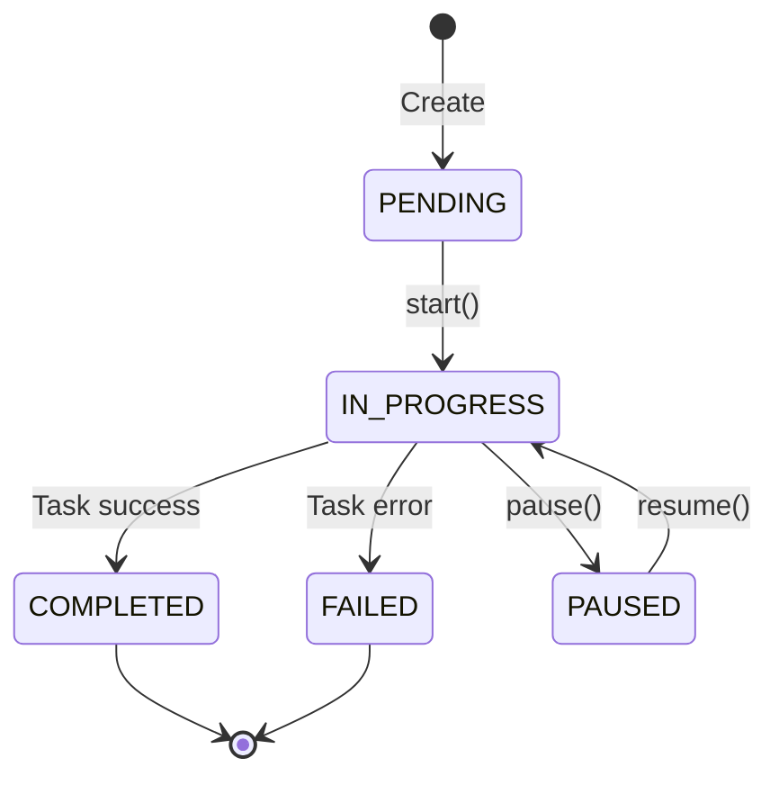
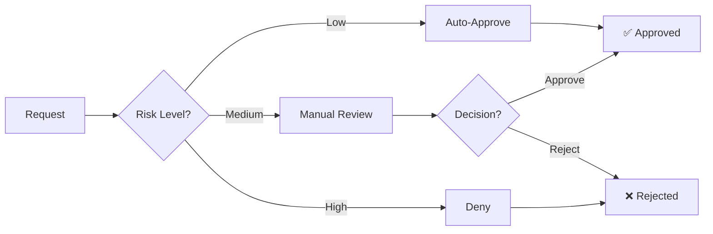
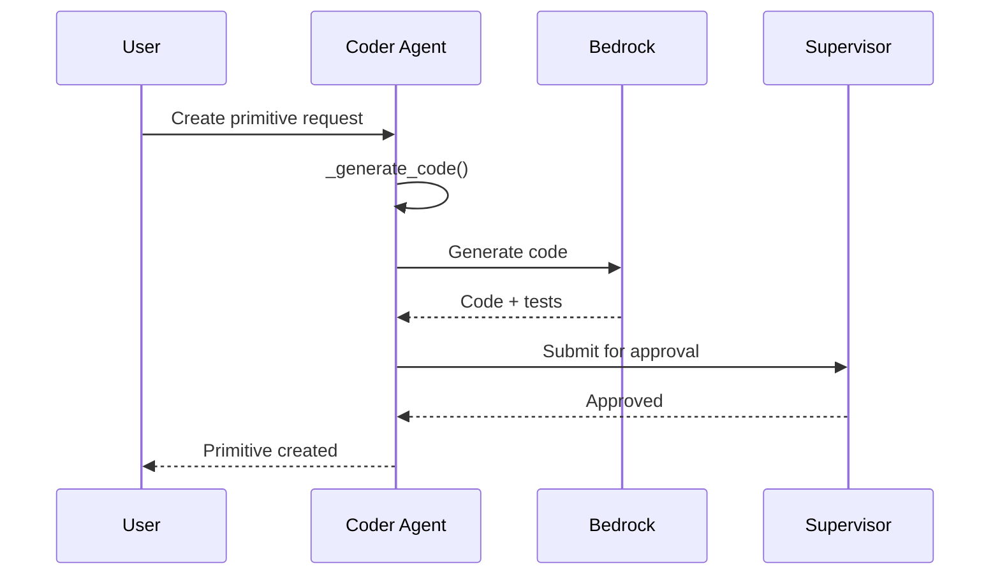
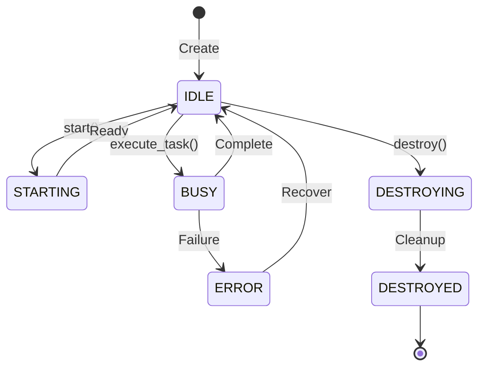

# octopOS Component Reference

Detailed reference for all major components in octopOS.

---

## Table of Contents

1. [Engine Components](#engine-components)
2. [Specialist Agents](#specialist-agents)
3. [Memory Components](#memory-components)
4. [Worker Components](#worker-components)
5. [Primitives](#primitives)
6. [Interface Components](#interface-components)
7. [Utility Components](#utility-components)

---

## Engine Components

### BaseAgent

**File:** [`src/engine/base_agent.py`](src/engine/base_agent.py)

**Purpose:** Abstract base class for all agents.

**Key Methods:**

| Method | Description |
|--------|-------------|
| `execute_task(task)` | Abstract method for task execution |
| `start()` | Start the agent |
| `stop()` | Stop the agent |
| `send_message(msg)` | Send message to another agent |
| `report_status()` | Report task status update |

**Lifecycle States:**


---

### Orchestrator

**File:** [`src/engine/orchestrator.py`](src/engine/orchestrator.py)

**Purpose:** Main Brain - central coordinator for all agents.

**Responsibilities:**
- Agent registration and discovery
- Task distribution
- System health monitoring

**Key Methods:**

| Method | Description |
|--------|-------------|
| `register_agent(agent)` | Register an agent |
| `get_agent(name)` | Get agent by name |
| `list_agents()` | List all registered agents |
| `execute_task(task)` | Execute a task |

---

### Supervisor

**File:** [`src/engine/supervisor.py`](src/engine/supervisor.py)

**Purpose:** Security and approval enforcement.

**Key Methods:**

| Method | Description |
|--------|-------------|
| `scan_code(code)` | Scan code for security issues |
| `_process_approval_request(data)` | Process approval requests |
| `_analyze_imports(code)` | Analyze Python imports |

**Security Scan Results:**
```python
{
    "status": "success",
    "blocked": ["os.system", "subprocess.call"],
    "allowed": ["json", "pathlib"],
    "unverified": ["requests"],
    "valid": False
}
```

**Approval Workflow:**


---

### Workflow Integration

**File:** [`src/engine/workflow_integration.py`](src/engine/workflow_integration.py)

**Purpose:** Complete workflow orchestration for primitive creation.

**Class:** `CompleteWorkflowOrchestrator`

**Workflow Steps:**
1. Check IntentFinder for existing primitives
2. Create new primitive (if needed) via Coder Agent
3. Test code via Self-Healing Agent
4. Request approval from Supervisor
5. Register approved primitive with IntentFinder

---

### Message System

**File:** [`src/engine/message.py`](src/engine/message.py)

**Components:**

| Component | Purpose |
|-----------|---------|
| `OctoMessage` | Standard message format |
| `MessageType` | Enum of message types |
| `TaskPayload` | Task assignment payload |
| `ErrorPayload` | Error information |
| `ApprovalPayload` | Approval request/response |
| `StatusPayload` | Progress updates |

**Message Types:**
- `TASK` - Task assignment
- `ERROR` - Error reporting
- `APPROVAL_REQUEST` - Request for approval
- `APPROVAL_GRANTED` - Approval response
- `APPROVAL_DENIED` - Denial response
- `STATUS_UPDATE` - Progress reporting
- `SYSTEM` - Internal messages
- `CHAT` - User-facing messages

---

### Scheduler

**File:** [`src/engine/scheduler.py`](src/engine/scheduler.py)

**Purpose:** Task scheduling with AWS EventBridge integration.

**Key Methods:**

| Method | Description |
|--------|-------------|
| `schedule_task(task, cron)` | Schedule recurring task |
| `get_due_tasks()` | Get tasks ready for execution |
| `cancel_task(task_id)` | Cancel scheduled task |

---

### Dead Letter Queue

**File:** [`src/engine/dead_letter_queue.py`](src/engine/dead_letter_queue.py)

**Purpose:** Store and retry failed messages.

**Key Methods:**

| Method | Description |
|--------|-------------|
| `enqueue(message, error)` | Add failed message |
| `process_pending()` | Retry pending messages |
| `get_stats()` | Get DLQ statistics |

---

## Specialist Agents

### Manager Agent

**File:** [`src/specialist/manager_agent.py`](src/specialist/manager_agent.py)

**Purpose:** Central coordinator for other agents.

**Key Components:**
- `AgentRegistry` - Agent directory
- `AgentRouter` - Task routing
- `WorkflowEngine` - Multi-step workflow execution

**Key Methods:**

| Method | Description |
|--------|-------------|
| `execute_task(task)` | Execute task through appropriate agent |
| `create_workflow(steps)` | Create multi-agent workflow |
| `get_agent_status()` | Query agent health |
| `route_message(msg, capability)` | Route message by capability |

---

### Coder Agent

**File:** [`src/specialist/coder_agent.py`](src/specialist/coder_agent.py)

**Purpose:** Generate and modify code primitives.

**Key Methods:**

| Method | Description |
|--------|-------------|
| `create_primitive(desc, reqs)` | Generate new primitive |
| `modify_primitive(name, changes)` | Modify existing primitive |
| `_generate_code(desc, reqs)` | Call LLM for code generation |
| `approve_primitive(id, approved)` | Handle approval decision |

**Workflow:**


---

### Self-Healing Agent

**File:** [`src/specialist/self_healing_agent.py`](src/specialist/self_healing_agent)

**Purpose:** Diagnose and repair errors automatically.

**Key Methods:**

| Method | Description |
|--------|-------------|
| `diagnose_error(error, context)` | Analyze error |
| `repair_code(code, error)` | Attempt code repair |
| `analyze_failure(logs)` | Analyze failure patterns |

**Diagnosis Types:**
- `syntax_error` - Code syntax issues
- `import_error` - Missing dependencies
- `runtime_error` - Execution failures
- `connection_error` - Network/service issues
- `timeout_error` - Execution timeouts

---

### Browser Agent

**File:** [`src/specialist/browser_agent.py`](src/specialist/browser_agent.py)

**Purpose:** Web automation and scraping.

**Key Methods:**

| Method | Description |
|--------|-------------|
| `start_mission(url, goal)` | Start browser mission |
| `get_mission_status(id)` | Check mission progress |
| `execute_action(action)` | Execute browser action |

---

## Memory Components

### Semantic Memory

**File:** [`src/engine/memory/semantic_memory.py`](src/engine/memory/semantic_memory.py)

**Purpose:** Long-term memory storage with vector search.

**Key Methods:**

| Method | Description |
|--------|-------------|
| `remember(content, category, source)` | Store memory |
| `recall(query, top_k)` | Search memories |
| `prune_decayed_memories(threshold)` | Remove old memories |

**Memory Decay Formula:**
```
Score = (access_count * weight) - (days_since_access * decay_rate)
```

**Storage:** LanceDB with vector embeddings

---

### IntentFinder

**File:** [`src/engine/memory/intent_finder.py`](src/engine/memory/intent_finder.py)

**Purpose:** Match user requests to available tools.

**Key Methods:**

| Method | Description |
|--------|-------------|
| `find_primitives(query, top_k)` | Find matching primitives |
| `add_primitive(name, desc, code)` | Register new primitive |
| `get_stats()` | Get registration stats |

**Matching Algorithm:**
- Vector similarity search
- Threshold: 0.8 confidence
- Returns top-k matches

---

### Fact Extractor

**File:** [`src/engine/memory/fact_extractor.py`](src/engine/memory/fact_extractor.py)

**Purpose:** Extract user facts from conversations.

**Key Methods:**

| Method | Description |
|--------|-------------|
| `extract_facts(text)` | Extract facts from text |
| `categorize_fact(fact)` | Categorize fact type |
| `store_fact(fact)` | Store in memory |

**Fact Categories:**
- `personal` - Personal information
- `professional` - Work-related
- `preference` - Likes/dislikes
- `location` - Geographic information

---

### Working Memory

**File:** [`src/engine/memory/working_memory.py`](src/engine/memory/working_memory.py)

**Purpose:** Short-term context for conversations.

**Key Methods:**

| Method | Description |
|--------|-------------|
| `add_context(key, value)` | Add context item |
| `get_context(key)` | Retrieve context |
| `clear_context()` | Clear all context |

---

### Semantic Cache

**File:** [`src/engine/memory/semantic_cache.py`](src/engine/memory/semantic_cache.py)

**Purpose:** Cache LLM responses for similar queries.

**Key Methods:**

| Method | Description |
|--------|-------------|
| `get(query)` | Check cache |
| `set(query, response)` | Store response |
| `clear()` | Clear cache |

---

## Worker Components

### BaseWorker

**File:** [`src/workers/base_worker.py`](src/workers/base_worker.py)

**Purpose:** Foundation for ephemeral task execution.

**Lifecycle:**


**Key Methods:**

| Method | Description |
|--------|-------------|
| `start()` | Initialize worker |
| `execute_task(task)` | Execute task |
| `destroy()` | Cleanup resources |
| `get_status()` | Get current status |

---

### Ephemeral Container

**File:** [`src/workers/ephemeral_container.py`](src/workers/ephemeral_container.py)

**Purpose:** Docker container management for workers.

**Key Methods:**

| Method | Description |
|--------|-------------|
| `create_container()` | Start Docker container |
| `execute_in_container(cmd)` | Run command |
| `destroy_container()` | Stop and remove |

**Security Features:**
- Read-only filesystem
- Network isolation
- Resource limits
- No privilege escalation

---

### Worker Pool

**File:** [`src/workers/worker_pool.py`](src/workers/worker_pool.py)

**Purpose:** Manage multiple workers with auto-scaling.

**Key Methods:**

| Method | Description |
|--------|-------------|
| `get_worker()` | Get available worker |
| `execute_task(task, config)` | Execute with auto-worker |
| `get_stats()` | Get pool statistics |
| `scale_workers(count)` | Adjust worker count |

**Configuration:**
```python
WorkerConfig(
    max_memory_mb=512,
    max_cpu_cores=1.0,
    max_execution_time=300,
    image="octopos-sandbox:latest"
)
```

---

## Primitives

### BasePrimitive

**File:** [`src/primitives/base_primitive.py`](src/primitives/base_primitive.py)

**Purpose:** Abstract base for all tools.

**Required Methods:**

| Method | Description |
|--------|-------------|
| `name` | Property: tool name |
| `description` | Property: tool description |
| `execute(**params)` | Execute the tool |

---

### Tool Registry

**File:** [`src/primitives/tool_registry.py`](src/primitives/tool_registry.py)

**Purpose:** Central registry for all primitives.

**Key Methods:**

| Method | Description |
|--------|-------------|
| `register_primitive(primitive, category)` | Add primitive |
| `get_primitive(name)` | Get by name |
| `list_primitives(category)` | List by category |
| `search_primitives(query)` | Search primitives |

---

### MCP Adapter

**Files:**
- [`src/primitives/mcp_adapter/mcp_client.py`](src/primitives/mcp_adapter/mcp_client.py)
- [`src/primitives/mcp_adapter/mcp_tool_wrapper.py`](src/primitives/mcp_adapter/mcp_tool_wrapper.py)
- [`src/primitives/mcp_adapter/mcp_transport.py`](src/primitives/mcp_adapter/mcp_transport.py)

**Purpose:** Integration with Model Context Protocol servers.

---

### AWS Primitives

**Files:** [`src/primitives/cloud_aws/`](src/primitives/cloud_aws/)

**Available Tools:**
| Tool | Purpose |
|------|---------|
| `BedrockInvoker` | Call Bedrock models |
| `CloudWatchInspector` | Monitor AWS resources |
| `DynamoDBClient` | DynamoDB operations |
| `S3Manager` | S3 file operations |

---

### Web Primitives

**Files:** [`src/primitives/web/`](src/primitives/web/)

**Available Tools:**
| Tool | Purpose |
|------|---------|
| `BrowserSession` | Web browser automation |
| `SearchEngine` | Web search |
| `PublicAPICaller` | Call public APIs |
| `NovaActDriver` | Nova Act integration |
| `ResultVisualizer` | Format results |

---

## Interface Components

### CLI

**Files:**
- [`src/interfaces/cli/main.py`](src/interfaces/cli/main.py)
- [`src/interfaces/cli/commands.py`](src/interfaces/cli/commands.py)

**Commands:**
| Command | Purpose |
|---------|---------|
| `setup` | Configuration wizard |
| `status` | System status |
| `ask` | Single query |
| `chat` | Interactive session |
| `budget` | Token budget |
| `cache-stats` | Cache statistics |
| `dlq` | Dead letter queue |

---

### Message Adapter

**File:** [`src/interfaces/message_adapter.py`](src/interfaces/message_adapter.py)

**Purpose:** Unified interface for all platforms.

**Supported Platforms:**
- Telegram
- Slack
- WhatsApp
- Voice (Nova Sonic)

---

### Platform Adapters

**Telegram:** [`src/interfaces/telegram/`](src/interfaces/telegram/)
- `bot.py` - Bot implementation
- `message_adapter.py` - Message conversion
- `webhook_handler.py` - Webhook endpoint

**Slack:** [`src/interfaces/slack/`](src/interfaces/slack/)
- `bot.py` - Bot implementation
- `event_handler.py` - Event processing
- `message_adapter.py` - Message conversion

**WhatsApp:** [`src/interfaces/whatsapp/`](src/interfaces/whatsapp/)
- `bot.py` - Business API integration
- `webhook_handler.py` - Webhook handling

**Voice:** [`src/interfaces/voice/`](src/interfaces/voice/)
- `nova_sonic.py` - Speech-to-speech
- `audio_handler.py` - Audio processing
- `voice_session.py` - Session management

---

## Utility Components

### Configuration

**File:** [`src/utils/config.py`](src/utils/config.py)

**Purpose:** Configuration management.

**Config Classes:**
- `AWSConfig` - AWS settings
- `AgentConfig` - Agent identity
- `UserConfig` - User preferences
- `SecurityConfig` - Security policies
- `LanceDBConfig` - Vector store
- `LoggingConfig` - Logging settings
- `TaskConfig` - Task queue
- `BrowserConfig` - Browser settings
- `MCPConfig` - MCP servers

---

### Bedrock Guardrails

**File:** [`src/utils/bedrock_guardrails.py`](src/utils/bedrock_guardrails.py)

**Purpose:** Content filtering and safety.

**Key Methods:**

| Method | Description |
|--------|-------------|
| `apply_guardrails(content, source)` | Apply filters |
| `filter_input(prompt)` | Filter user input |
| `filter_output(response)` | Filter model output |

---

### CloudWatch Logger

**File:** [`src/utils/cloudwatch_logger.py`](src/utils/cloudwatch_logger.py)

**Purpose:** AWS CloudWatch integration.

**Key Methods:**

| Method | Description |
|--------|-------------|
| `put_metric(name, value)` | Log metric |
| `log_event(message)` | Log event |
| `flush()` | Send batch |

---

### Token Budget

**File:** [`src/utils/token_budget.py`](src/utils/token_budget.py)

**Purpose:** Track and limit API costs.

**Key Methods:**

| Method | Description |
|--------|-------------|
| `record_usage(session, tokens)` | Record token usage |
| `check_budget(session)` | Check limits |
| `get_summary()` | Get usage summary |

---

### AWS EventBridge

**File:** [`src/utils/aws_eventbridge.py`](src/utils/aws_eventbridge.py)

**Purpose:** Serverless scheduling.

**Key Methods:**

| Method | Description |
|--------|-------------|
| `create_rule(name, schedule)` | Create scheduled rule |
| `delete_rule(name)` | Remove rule |
| `list_rules()` | List all rules |

---

*For usage examples, see [API Documentation](API.md).*