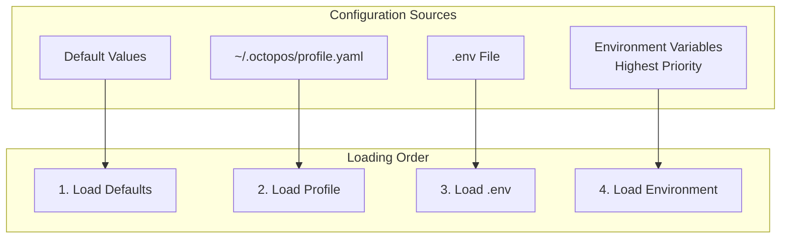

# octopOS Configuration Guide

Complete guide to configuring octopOS for different environments and use cases.

---

## Table of Contents

1. [Configuration Sources](#configuration-sources)
2. [Configuration Files](#configuration-files)
3. [Environment Variables](#environment-variables)
4. [Configuration Sections](#configuration-sections)
5. [Environment-Specific Configurations](#environment-specific-configurations)
6. [Security Configuration](#security-configuration)
7. [Troubleshooting](#troubleshooting)

---

## Configuration Sources

octopOS loads configuration from multiple sources in order of precedence (highest to lowest):

1. **Environment Variables** (`OCTO_*`)
2. **`.env` File** (project root)
3. **User Profile** (`~/.octopos/profile.yaml`)
4. **Default Values** (built-in)



---

## Configuration Files

### User Profile

Location: `~/.octopos/profile.yaml`

This is the main configuration file for user-specific settings:

```yaml
# ~/.octopos/profile.yaml

# AWS Configuration
aws:
  region: us-east-1
  profile: default  # AWS CLI profile name
  # Or use explicit credentials (not recommended)
  # access_key_id: AKIA...
  # secret_access_key: ...
  
  # Bedrock Model Configuration
  model_nova_lite: amazon.nova-lite-v1:0
  model_nova_pro: amazon.nova-pro-v1:0
  model_nova_act: amazon.nova-act-v1:0
  model_nova_sonic: amazon.nova-sonic-v1:0
  model_embedding: amazon.titan-embed-text-v2:0
  
  # Guardrails (optional)
  guardrail_id: ""
  guardrail_version: "DRAFT"

# Agent Identity
agent:
  name: octoOS
  persona: friendly  # friendly, professional, technical
  language: en

# User Preferences
user:
  name: ""
  timezone: UTC
  workspace_path: ~/octopos-workspace
  preferred_aws_services: []

# Vector Database
lancedb:
  path: ./data/lancedb
  table_primitives: primitives
  table_memory: memory
  table_public_apis: public_apis

# Logging Configuration
logging:
  level: INFO  # DEBUG, INFO, WARNING, ERROR, CRITICAL
  destination: stdout  # stdout, file, cloudwatch
  format: text  # text, json
  
  # File logging (when destination is 'file')
  file_path: ./logs/octopos.log
  file_max_bytes: 10485760  # 10MB
  file_backup_count: 5
  
  # CloudWatch logging (when destination is 'cloudwatch')
  cloudwatch_log_group: /octopos/agents
  cloudwatch_log_stream: default
  
  # Security
  enable_correlation_id: true
  mask_sensitive_data: true
  mask_character: "*"

# Task Queue
task:
  db_path: ./data/tasks.db
  db_type: sqlite  # sqlite, dynamodb
  dynamodb_table_tasks: octopos-tasks
  dynamodb_table_schedule: octopos-schedule

# Security Settings
security:
  require_approval_for_code: true
  require_approval_for_deletions: true
  auto_approve_safe_operations: false
  docker_network: octopos-sandbox
  docker_cpu_limit: "1.0"
  docker_memory_limit: "512m"

# Web Search & Scraping
web:
  brave_api_key: ""  # For Brave Search API
  ddg_region: wt-wt  # DuckDuckGo region
  ddg_safesearch: moderate
  nova_act_model: amazon.nova-lite-v1:0
  max_html_size: 512000  # 500KB
  default_currency: TRY
  discovery_enabled: true

# Browser Automation
browser:
  headless: false
  timeout: 30000  # 30 seconds
  slow_mo: 100  # milliseconds
  viewport_width: 1920
  viewport_height: 1080
  profile_dir: ~/.octopos/browser_profiles
  persist_cookies: true
  persist_local_storage: true
  default_profile: default
  nova_act_model: amazon.nova-pro-v1:0
  max_steps_per_mission: 20
  screenshot_on_each_step: true
  screenshot_quality: 80
  require_approval_for_critical: true

# MCP Configuration
mcp:
  auto_connect: true
  servers:
    example-server:
      transport: stdio
      command: python
      args: ["/path/to/server.py"]
      enabled: true
```

### Environment File

Location: `.env` (project root)

For development and deployment-specific settings:

```bash
# AWS Configuration
AWS_REGION=us-east-1
AWS_PROFILE=default

# Agent Settings
OCTO_AGENT_NAME=octoOS
OCTO_AGENT_PERSONA=friendly

# Paths
OCTO_WORKSPACE_PATH=~/octopos-workspace
OCTO_LANCEDB_PATH=./data/lancedb

# Logging
OCTO_LOG_LEVEL=INFO
OCTO_LOG_DESTINATION=stdout
CLOUDWATCH_LOG_GROUP=/octopos/agents
CLOUDWATCH_LOG_STREAM=local

# Security
OCTO_REQUIRE_APPROVAL=true
OCTO_AUTO_APPROVE_SAFE=false

# Development Flags
OCTO_MOCK_AWS=false
OCTO_DEBUG=false
OCTO_TEST_MODE=false
```

---

## Environment Variables

### AWS Configuration

| Variable | Description | Default |
|----------|-------------|---------|
| `AWS_REGION` | AWS region | `us-east-1` |
| `AWS_PROFILE` | AWS CLI profile | `default` |
| `AWS_ACCESS_KEY_ID` | AWS access key | - |
| `AWS_SECRET_ACCESS_KEY` | AWS secret key | - |
| `AWS_SESSION_TOKEN` | AWS session token | - |
| `AWS_ROLE_ARN` | IAM role to assume | - |

### Agent Configuration

| Variable | Description | Default |
|----------|-------------|---------|
| `OCTO_AGENT_NAME` | Agent name | `octoOS` |
| `OCTO_AGENT_PERSONA` | Personality (friendly/professional/technical) | `friendly` |
| `OCTO_AGENT_LANGUAGE` | Language code | `en` |

### User Configuration

| Variable | Description | Default |
|----------|-------------|---------|
| `OCTO_USER_NAME` | User name | - |
| `OCTO_USER_TIMEZONE` | Timezone | `UTC` |
| `OCTO_WORKSPACE_PATH` | Workspace directory | `~/octopos-workspace` |

### Logging Configuration

| Variable | Description | Default |
|----------|-------------|---------|
| `OCTO_LOG_LEVEL` | Log level | `INFO` |
| `OCTO_LOG_DESTINATION` | Output destination | `stdout` |
| `LOG_FILE_PATH` | Log file path | `./logs/octopos.log` |
| `CLOUDWATCH_LOG_GROUP` | CloudWatch log group | `/octopos/agents` |
| `CLOUDWATCH_LOG_STREAM` | CloudWatch log stream | `default` |

### Security Configuration

| Variable | Description | Default |
|----------|-------------|---------|
| `OCTO_REQUIRE_APPROVAL` | Require approval for code | `true` |
| `OCTO_AUTO_APPROVE_SAFE` | Auto-approve safe operations | `false` |

### Development Flags

| Variable | Description | Default |
|----------|-------------|---------|
| `OCTO_MOCK_AWS` | Mock AWS services | `false` |
| `OCTO_DEBUG` | Enable debug mode | `false` |
| `OCTO_TEST_MODE` | Enable test mode | `false` |

---

## Configuration Sections

### AWS Configuration

```python
@dataclass
class AWSConfig:
    region: str = "us-east-1"
    profile: Optional[str] = None
    access_key_id: Optional[str] = None
    secret_access_key: Optional[str] = None
    session_token: Optional[str] = None
    role_arn: Optional[str] = None
    role_session_name: str = "octopos-session"
    
    # Bedrock models
    model_nova_lite: str = "amazon.nova-lite-v1:0"
    model_nova_pro: str = "amazon.nova-pro-v1:0"
    model_nova_act: str = "amazon.nova-act-v1:0"
    model_nova_sonic: str = "amazon.nova-sonic-v1:0"
    model_embedding: str = "amazon.titan-embed-text-v2:0"
    
    # Guardrails
    guardrail_id: Optional[str] = None
    guardrail_version: str = "DRAFT"
```

**Best Practices:**
- Use `AWS_PROFILE` for local development
- Use IAM roles for production deployments
- Never commit access keys to version control
- Set `guardrail_id` for content filtering

### Agent Configuration

```python
@dataclass
class AgentConfig:
    name: str = "octoOS"
    persona: AgentPersona = AgentPersona.FRIENDLY
    language: str = "en"
```

**Personas:**
- `friendly` - Conversational, approachable tone
- `professional` - Business-appropriate, concise
- `technical` - Detailed, assumes technical knowledge

### Security Configuration

```python
@dataclass
class SecurityConfig:
    require_approval_for_code: bool = True
    require_approval_for_deletions: bool = True
    auto_approve_safe_operations: bool = False
    docker_network: str = "octopos-sandbox"
    docker_cpu_limit: str = "1.0"
    docker_memory_limit: str = "512m"
```

**Security Levels:**

| Setting | Development | Production |
|---------|-------------|------------|
| `require_approval_for_code` | `false` | `true` |
| `require_approval_for_deletions` | `false` | `true` |
| `auto_approve_safe_operations` | `true` | `false` |
| `docker_network` | `bridge` | `none` |

### Browser Configuration

```python
@dataclass
class BrowserConfig:
    headless: bool = False
    timeout: int = 30000
    slow_mo: int = 100
    viewport_width: int = 1920
    viewport_height: int = 1080
    profile_dir: str = "~/.octopos/browser_profiles"
    persist_cookies: bool = True
    persist_local_storage: bool = True
    default_profile: str = "default"
    nova_act_model: str = "amazon.nova-pro-v1:0"
    max_steps_per_mission: int = 20
    screenshot_on_each_step: bool = True
    screenshot_quality: int = 80
    require_approval_for_critical: bool = True
```

---

## Environment-Specific Configurations

### Local Development

```yaml
# ~/.octopos/profile.yaml
aws:
  region: us-east-1
  profile: default

logging:
  level: DEBUG
  destination: stdout

security:
  require_approval_for_code: false
  auto_approve_safe_operations: true

browser:
  headless: false  # Show browser for debugging
```

### Production

```yaml
# ~/.octopos/profile.yaml
aws:
  region: eu-west-1
  role_arn: arn:aws:iam::123456789:role/octopos-role

logging:
  level: INFO
  destination: cloudwatch

security:
  require_approval_for_code: true
  require_approval_for_deletions: true
  auto_approve_safe_operations: false

browser:
  headless: true
  require_approval_for_critical: true
```

### CI/CD Pipeline

```yaml
# CI/CD environment variables
AWS_REGION: us-east-1
AWS_ACCESS_KEY_ID: ${{ secrets.AWS_ACCESS_KEY_ID }}
AWS_SECRET_ACCESS_KEY: ${{ secrets.AWS_SECRET_ACCESS_KEY }}
OCTO_TEST_MODE: true
OCTO_MOCK_AWS: true
OCTO_LOG_LEVEL: ERROR
```

---

## Security Configuration

### Bedrock Guardrails

To enable content filtering:

1. Create a Guardrail in AWS Bedrock Console
2. Add the guardrail ID to configuration:

```yaml
aws:
  guardrail_id: "your-guardrail-id"
  guardrail_version: "1"  # or "DRAFT"
```

### Docker Sandbox

Configure resource limits for ephemeral workers:

```yaml
security:
  docker_cpu_limit: "1.0"      # CPU cores
  docker_memory_limit: "512m"   # Memory
  docker_network: "none"        # Network isolation
```

### Approval Workflows

Fine-tune approval requirements:

```yaml
security:
  require_approval_for_code: true
  require_approval_for_deletions: true
  auto_approve_safe_operations: false
```

**Safe operations** (auto-approved when enabled):
- Reading files
- Listing directories
- Non-destructive queries

**Requires approval:**
- Code execution
- File modifications
- AWS resource changes
- Network operations

---

## Troubleshooting

### Configuration Not Loading

1. Check file location: `~/.octopos/profile.yaml`
2. Validate YAML syntax
3. Check file permissions

```bash
# Test configuration loading
python -c "from src.utils.config import get_config; print(get_config())"
```

### AWS Credentials Issues

```bash
# Verify AWS CLI configuration
aws sts get-caller-identity

# Check profile
aws configure list --profile default
```

### Environment Variables Not Applied

```bash
# Check if variable is set
echo $OCTO_LOG_LEVEL

# List all OCTO variables
env | grep OCTO
```

### Docker Sandbox Issues

```bash
# Verify Docker is running
docker info

# Check network exists
docker network ls | grep octopos-sandbox

# Create network if missing
docker network create octopos-sandbox
```

---

*For more information, see [API Documentation](API.md) and [Deployment Guide](DEPLOYMENT.md).*