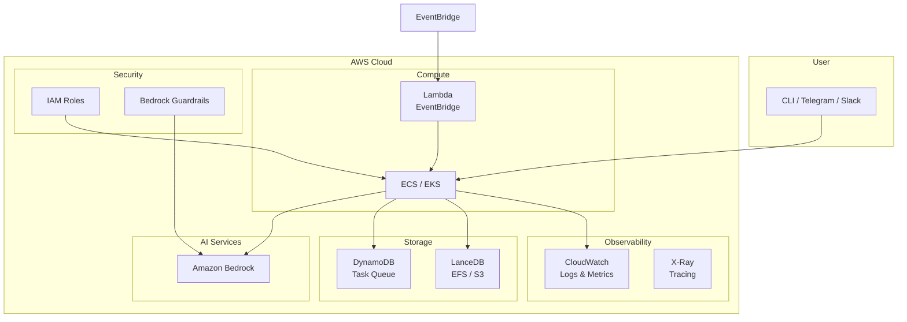
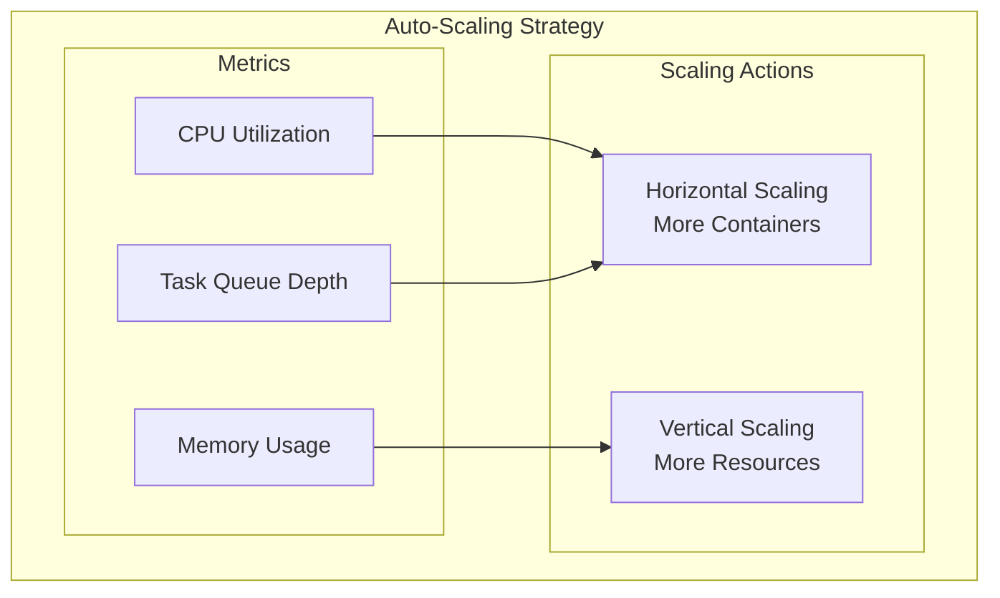

# octopOS Deployment Guide

Guide for deploying octopOS in various environments.

---

## Table of Contents

1. [Prerequisites](#prerequisites)
2. [Local Deployment](#local-deployment)
3. [Docker Deployment](#docker-deployment)
4. [AWS Deployment](#aws-deployment)
5. [Production Considerations](#production-considerations)
6. [Monitoring & Observability](#monitoring--observability)
7. [Troubleshooting](#troubleshooting)

---

## Prerequisites

### System Requirements

| Component | Minimum | Recommended |
|-----------|---------|-------------|
| Python | 3.11 | 3.11+ |
| RAM | 4 GB | 8 GB+ |
| Disk | 10 GB | 50 GB+ |
| Docker | 20.10+ | Latest |
| AWS CLI | 2.0+ | Latest |

### Required Services

- **AWS Account** with access to:
  - Amazon Bedrock
  - Amazon CloudWatch (optional)
  - Amazon DynamoDB (optional)
  - AWS EventBridge (optional)

- **Docker** for sandboxed execution

---

## Local Deployment

### 1. Clone Repository

```bash
git clone https://github.com/yourusername/octopos.git
cd octopos
```

### 2. Create Virtual Environment

```bash
python -m venv venv
source venv/bin/activate  # On Windows: venv\Scripts\activate
```

### 3. Install Dependencies

```bash
pip install -e ".[dev]"
```

### 4. Configure Environment

```bash
# Copy example environment file
cp .env.example .env

# Edit configuration
nano .env
```

Minimum required configuration:
```bash
AWS_REGION=us-east-1
AWS_PROFILE=default
```

### 5. Initialize System

```bash
# Run setup wizard
octo setup

# Or manual configuration
mkdir -p ~/.octopos
mkdir -p ~/octopos-workspace
```

### 6. Verify Installation

```bash
# Check version
octo --version

# Check status
octo status

# Test with a simple command
octo ask "List files in current directory"
```

---

## Docker Deployment

### Docker Compose Setup

```yaml
# docker-compose.yml
version: '3.8'

services:
  octopos:
    build: .
    container_name: octopos
    environment:
      - AWS_REGION=${AWS_REGION}
      - AWS_ACCESS_KEY_ID=${AWS_ACCESS_KEY_ID}
      - AWS_SECRET_ACCESS_KEY=${AWS_SECRET_ACCESS_KEY}
      - OCTO_LOG_LEVEL=INFO
    volumes:
      - ./data:/app/data
      - ~/.aws:/root/.aws:ro
      - /var/run/docker.sock:/var/run/docker.sock
    networks:
      - octopos-network
    restart: unless-stopped

networks:
  octopos-network:
    driver: bridge
```

### Dockerfile

```dockerfile
FROM python:3.11-slim

WORKDIR /app

# Install system dependencies
RUN apt-get update && apt-get install -y \
    git \
    docker.io \
    && rm -rf /var/lib/apt/lists/*

# Copy requirements
COPY pyproject.toml .
COPY src/ ./src/

# Install Python dependencies
RUN pip install -e "."

# Create necessary directories
RUN mkdir -p /app/data /app/logs

# Expose ports (for webhooks)
EXPOSE 8000

# Run octopOS
CMD ["octo", "chat"]
```

### Build and Run

```bash
# Build image
docker-compose build

# Start services
docker-compose up -d

# View logs
docker-compose logs -f

# Stop services
docker-compose down
```

---

## AWS Deployment

### Architecture



### ECS Deployment

#### 1. Create ECS Task Definition

```json
{
  "family": "octopos",
  "networkMode": "awsvpc",
  "requiresCompatibilities": ["FARGATE"],
  "cpu": "2048",
  "memory": "4096",
  "executionRoleArn": "arn:aws:iam::123456789:role/ecsTaskExecutionRole",
  "taskRoleArn": "arn:aws:iam::123456789:role/octopos-task-role",
  "containerDefinitions": [
    {
      "name": "octopos",
      "image": "your-registry/octopos:latest",
      "essential": true,
      "environment": [
        {"name": "AWS_REGION", "value": "us-east-1"},
        {"name": "OCTO_LOG_LEVEL", "value": "INFO"},
        {"name": "OCTO_LOG_DESTINATION", "value": "cloudwatch"}
      ],
      "mountPoints": [
        {
          "sourceVolume": "data",
          "containerPath": "/app/data"
        }
      ],
      "logConfiguration": {
        "logDriver": "awslogs",
        "options": {
          "awslogs-group": "/ecs/octopos",
          "awslogs-region": "us-east-1",
          "awslogs-stream-prefix": "ecs"
        }
      }
    }
  ],
  "volumes": [
    {
      "name": "data",
      "efsVolumeConfiguration": {
        "fileSystemId": "fs-12345678",
        "rootDirectory": "/data"
      }
    }
  ]
}
```

#### 2. Create IAM Role

```json
{
  "Version": "2012-10-17",
  "Statement": [
    {
      "Effect": "Allow",
      "Action": [
        "bedrock:InvokeModel",
        "bedrock:InvokeModelWithResponseStream"
      ],
      "Resource": "*"
    },
    {
      "Effect": "Allow",
      "Action": [
        "logs:CreateLogGroup",
        "logs:CreateLogStream",
        "logs:PutLogEvents"
      ],
      "Resource": "arn:aws:logs:*:*:*"
    },
    {
      "Effect": "Allow",
      "Action": [
        "dynamodb:GetItem",
        "dynamodb:PutItem",
        "dynamodb:Query",
        "dynamodb:Scan"
      ],
      "Resource": "arn:aws:dynamodb:*:*:table/octopos-*"
    }
  ]
}
```

#### 3. Deploy with ECS CLI

```bash
# Create cluster
ecs-cli up --cluster-name octopos-cluster --region us-east-1

# Deploy service
ecs-cli compose --file docker-compose.yml service up \
  --cluster-config octopos-cluster \
  --ecs-profile octopos-profile
```

### Lambda Deployment (Scheduled Tasks)

```python
# lambda_function.py
import json
from src.tasks.task_queue import TaskQueue
from src.engine.scheduler import Scheduler

def handler(event, context):
    """Lambda handler for scheduled tasks."""
    queue = TaskQueue()
    scheduler = Scheduler()
    
    # Process scheduled tasks
    tasks = scheduler.get_due_tasks()
    for task in tasks:
        queue.enqueue(task)
    
    return {
        'statusCode': 200,
        'body': json.dumps(f'Processed {len(tasks)} tasks')
    }
```

```bash
# Deploy Lambda
aws lambda create-function \
  --function-name octopos-scheduler \
  --runtime python3.11 \
  --handler lambda_function.handler \
  --zip-file fileb://lambda.zip \
  --role arn:aws:iam::123456789:role/lambda-role \
  --environment Variables={AWS_REGION=us-east-1}

# Create EventBridge rule
aws events put-rule \
  --name octopos-schedule \
  --schedule-expression "rate(5 minutes)"

# Add target
aws events put-targets \
  --rule octopos-schedule \
  --targets "Id"="1","Arn"="arn:aws:lambda:us-east-1:123456789:function:octopos-scheduler"
```

---

## Production Considerations

### Security Checklist

- [ ] Enable Bedrock Guardrails
- [ ] Use IAM roles instead of access keys
- [ ] Enable CloudTrail for API auditing
- [ ] Configure VPC for network isolation
- [ ] Enable encryption at rest (DynamoDB, EFS)
- [ ] Set up AWS WAF for webhook endpoints
- [ ] Rotate credentials regularly
- [ ] Enable MFA for AWS accounts

### Performance Optimization

```yaml
# Production configuration
lancedb:
  path: /mnt/efs/lancedb  # Use EFS for shared storage

task:
  db_type: dynamodb  # Use DynamoDB for horizontal scaling

logging:
  destination: cloudwatch
  level: INFO  # Reduce log verbosity

security:
  require_approval_for_code: true
  auto_approve_safe_operations: false  # Stricter in production
```

### Scaling Strategy



---

## Monitoring & Observability

### CloudWatch Dashboard

```json
{
  "widgets": [
    {
      "type": "metric",
      "properties": {
        "metrics": [
          ["octopos", "agent_tasks_completed", "AgentType", "ManagerAgent"],
          [".", ".", ".", "CoderAgent"],
          [".", ".", ".", "SelfHealingAgent"]
        ],
        "period": 300,
        "stat": "Sum",
        "region": "us-east-1",
        "title": "Agent Task Completion"
      }
    },
    {
      "type": "metric",
      "properties": {
        "metrics": [
          ["octopos", "worker_execution_duration"],
          [".", "memory_usage"],
          [".", "error_count"]
        ],
        "period": 60,
        "stat": "Average",
        "region": "us-east-1",
        "title": "Worker Performance"
      }
    }
  ]
}
```

### Key Metrics

| Metric | Description | Alert Threshold |
|--------|-------------|-----------------|
| `agent_tasks_completed` | Tasks completed per agent | < 10/hour |
| `worker_execution_duration` | Average task execution time | > 60s |
| `error_count` | Number of errors | > 5/minute |
| `memory_usage` | Memory utilization | > 80% |
| `dlq_size` | Dead letter queue size | > 10 |

### Logging Best Practices

```python
# Enable correlation IDs for tracing
logging:
  enable_correlation_id: true
  correlation_id_header: x-correlation-id

# Mask sensitive data
mask_sensitive_data: true
mask_custom_patterns:
  - "password"
  - "secret"
  - "token"
```

---

## Troubleshooting

### Common Issues

#### Issue: Container fails to start
```bash
# Check logs
docker logs octopos

# Verify environment variables
docker exec octopos env | grep OCTO

# Check file permissions
ls -la data/
```

#### Issue: AWS credentials not working
```bash
# Verify IAM role
curl http://169.254.169.254/latest/meta-data/iam/security-credentials/

# Test AWS access
aws sts get-caller-identity

# Check Bedrock access
aws bedrock list-foundation-models
```

#### Issue: Workers not executing
```bash
# Check Docker socket access
docker ps

# Verify network
docker network ls

# Check worker pool logs
grep "worker" /app/logs/octopos.log
```

#### Issue: Memory database errors
```bash
# Check LanceDB initialization
ls -la data/lancedb/

# Verify permissions
chmod -R 755 data/

# Re-initialize
rm -rf data/lancedb/*
octo init
```

### Health Checks

```python
# health_check.py
from src.engine.orchestrator import get_orchestrator
from src.workers.worker_pool import get_worker_pool
from src.engine.memory.semantic_memory import SemanticMemory

async def health_check():
    checks = {
        "orchestrator": False,
        "worker_pool": False,
        "semantic_memory": False,
    }
    
    try:
        orch = get_orchestrator()
        checks["orchestrator"] = orch._initialized
    except:
        pass
    
    try:
        pool = get_worker_pool()
        stats = pool.get_stats()
        checks["worker_pool"] = stats["total_workers"] > 0
    except:
        pass
    
    try:
        memory = SemanticMemory()
        await memory.initialize()
        checks["semantic_memory"] = memory._initialized
    except:
        pass
    
    return checks
```

---

*For more information, see [Configuration Guide](CONFIGURATION.md) and [API Documentation](API.md).*