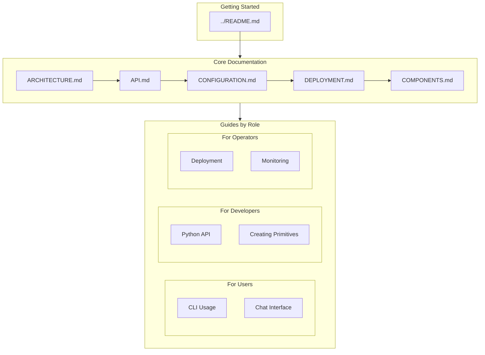

# octopOS Documentation

Welcome to the octopOS documentation. This directory contains comprehensive guides for understanding, configuring, deploying, and extending octopOS.

---

## Documentation Structure



---

## Quick Navigation

### 📚 Main Documents

| Document | Purpose | Audience |
|----------|---------|----------|
| [**README.md**](../README.md) | Project overview, quick start | Everyone |
| [**ARCHITECTURE.md**](ARCHITECTURE.md) | System architecture & design | Developers, Architects |
| [**API.md**](API.md) | API reference & examples | Developers |
| [**CONFIGURATION.md**](CONFIGURATION.md) | Configuration options | Users, Operators |
| [**DEPLOYMENT.md**](DEPLOYMENT.md) | Deployment guides | Operators, DevOps |
| [**COMPONENTS.md**](COMPONENTS.md) | Component reference | Developers |

---

## Getting Started

### First Time Users

1. Start with the [**main README**](../README.md) for project overview
2. Follow the [Installation Guide](../README.md#installation)
3. Learn about [CLI Commands](API.md#cli-commands)

### Developers

1. Understand the [Architecture](ARCHITECTURE.md)
2. Review the [API Reference](API.md#python-api)
3. Explore [Component Details](COMPONENTS.md)
4. Learn to [Create Primitives](API.md#primitive-development)

### Operators

1. Review [Configuration Options](CONFIGURATION.md)
2. Follow [Deployment Guide](DEPLOYMENT.md)
3. Set up [Monitoring & Observability](DEPLOYMENT.md#monitoring--observability)

---

## Architecture Overview

octopOS is built on a layered architecture:

```
┌─────────────────────────────────────────────────────────────┐
│                    Interface Layer                          │
│  CLI │ Telegram │ Slack │ WhatsApp │ Voice (Nova Sonic)    │
├─────────────────────────────────────────────────────────────┤
│                    Core Engine                              │
│  Orchestrator │ Message Bus │ Scheduler │ Supervisor        │
├─────────────────────────────────────────────────────────────┤
│                   Specialist Agents                         │
│  Manager │ Coder │ Self-Healing │ Browser                   │
├─────────────────────────────────────────────────────────────┤
│                   Memory System                             │
│  Semantic │ IntentFinder │ Fact Extractor │ Working Memory  │
├─────────────────────────────────────────────────────────────┤
│                   Execution Layer                           │
│  Worker Pool │ Ephemeral Containers │ Primitives           │
└─────────────────────────────────────────────────────────────┘
```

For detailed architecture documentation, see [ARCHITECTURE.md](ARCHITECTURE.md).

---

## Key Concepts

### Agents

Specialized AI agents that handle different tasks:

- **Manager Agent** - Coordinates other agents and routes tasks
- **Coder Agent** - Generates code for new tools
- **Self-Healing Agent** - Diagnoses and fixes errors
- **Supervisor** - Enforces security and approval workflows
- **Browser Agent** - Handles web automation

See: [Agent System](ARCHITECTURE.md#agent-system)

### Memory System

Multi-layer memory architecture:

- **Working Memory** - Short-term conversation context
- **Semantic Memory** - Long-term storage with vector search
- **IntentFinder** - Tool discovery and matching
- **Fact Extractor** - User preference learning

See: [Memory Architecture](ARCHITECTURE.md#memory-architecture)

### Primitives

Tools that agents can use to perform tasks:

- **AWS Primitives** - S3, DynamoDB, CloudWatch, Bedrock
- **Web Primitives** - Browser, Search, API calls
- **Dev Primitives** - Git, AST parsing
- **Native Primitives** - File operations, Bash
- **MCP Tools** - External tool integration

See: [Primitives System](ARCHITECTURE.md#primitives-system)

### Workers

Ephemeral Docker containers for isolated task execution:

- **BaseWorker** - Foundation for all workers
- **EphemeralContainer** - Docker container management
- **WorkerPool** - Dynamic worker scaling

See: [Worker System](ARCHITECTURE.md#worker-system)

---

## Configuration Quick Reference

### Minimal Configuration

```yaml
# ~/.octopos/profile.yaml
aws:
  region: us-east-1
  profile: default

agent:
  name: octoOS
  persona: friendly
```

### Environment Variables

```bash
export AWS_REGION=us-east-1
export OCTO_AGENT_NAME=octoOS
export OCTO_LOG_LEVEL=INFO
```

See: [Configuration Guide](CONFIGURATION.md)

---

## Common Tasks

### Running octopOS

```bash
# Interactive chat
octo chat

# Single command
octo ask "List files in directory"

# Check status
octo status
```

### Creating a Custom Primitive

```python
from src.primitives.base_primitive import BasePrimitive, PrimitiveResult

class MyTool(BasePrimitive):
    @property
    def name(self) -> str:
        return "my_tool"

    @property
    def description(self) -> str:
        return "Does something useful"

    async def execute(self, **params) -> PrimitiveResult:
        # Implementation
        return PrimitiveResult(
            success=True,
            data={"result": "done"},
            message="Success"
        )
```

See: [Primitive Development](API.md#primitive-development)

### Deploying to AWS

```bash
# Using ECS
ecs-cli compose up

# Using Docker Compose
docker-compose up -d
```

See: [Deployment Guide](DEPLOYMENT.md)

---

## Troubleshooting

### Common Issues

| Issue | Solution | Documentation |
|-------|----------|---------------|
| AWS credentials not working | Check `AWS_PROFILE` or set keys | [Configuration](CONFIGURATION.md#aws-configuration) |
| Docker errors | Verify Docker daemon is running | [Deployment](DEPLOYMENT.md#troubleshooting) |
| Memory errors | Check LanceDB permissions | [Deployment](DEPLOYMENT.md#troubleshooting) |
| Import errors | Install with `pip install -e "."` | [README](../README.md#installation) |

---

## Contributing

We welcome contributions! Please see our contributing guidelines:

1. Read the [Architecture](ARCHITECTURE.md) to understand the system
2. Follow the [API patterns](API.md) for consistency
3. Update documentation for any changes

---

## Resources

### External Links

- [AWS Bedrock Documentation](https://docs.aws.amazon.com/bedrock/)
- [LanceDB Documentation](https://lancedb.github.io/lancedb/)
- [Docker Documentation](https://docs.docker.com/)
- [Model Context Protocol](https://modelcontextprotocol.io/)

### Internal References

- [Architecture Diagrams](ARCHITECTURE.md#system-overview)
- [Component Reference](COMPONENTS.md)
- [CLI Commands](API.md#cli-commands)
- [Python API](API.md#python-api)

---

## Support

For issues and questions:

1. Check the [Troubleshooting Guide](DEPLOYMENT.md#troubleshooting)
2. Review [Configuration Options](CONFIGURATION.md)
3. Open an issue on GitHub

---

*Last updated: 2025-01-XX*