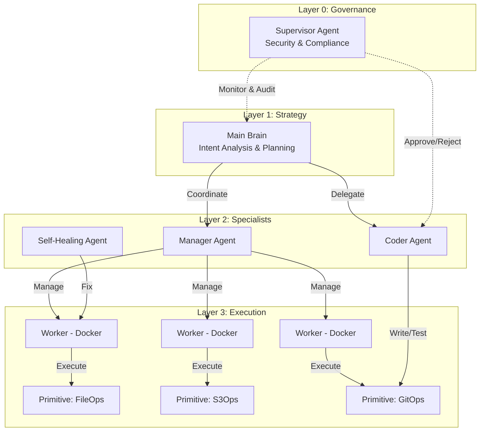
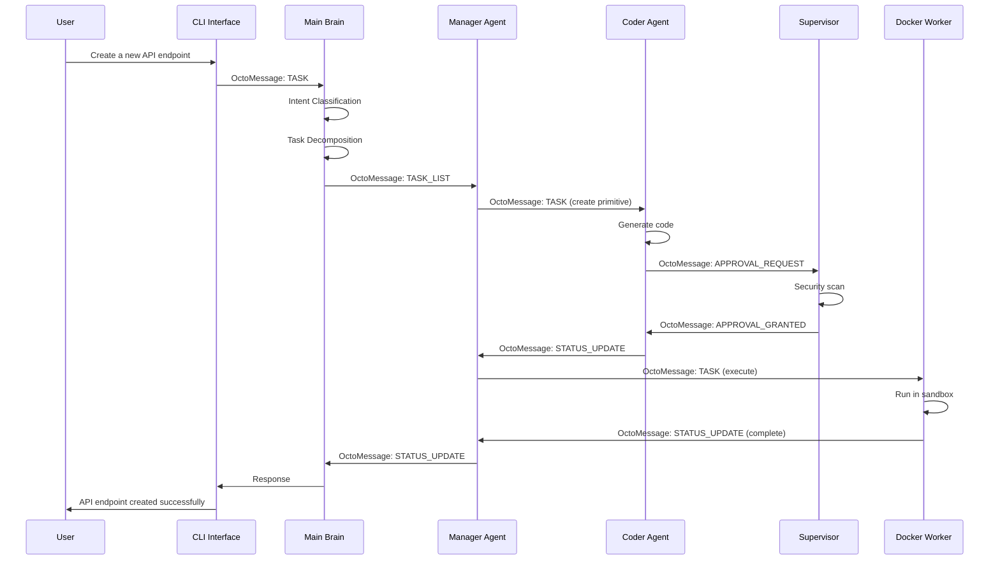
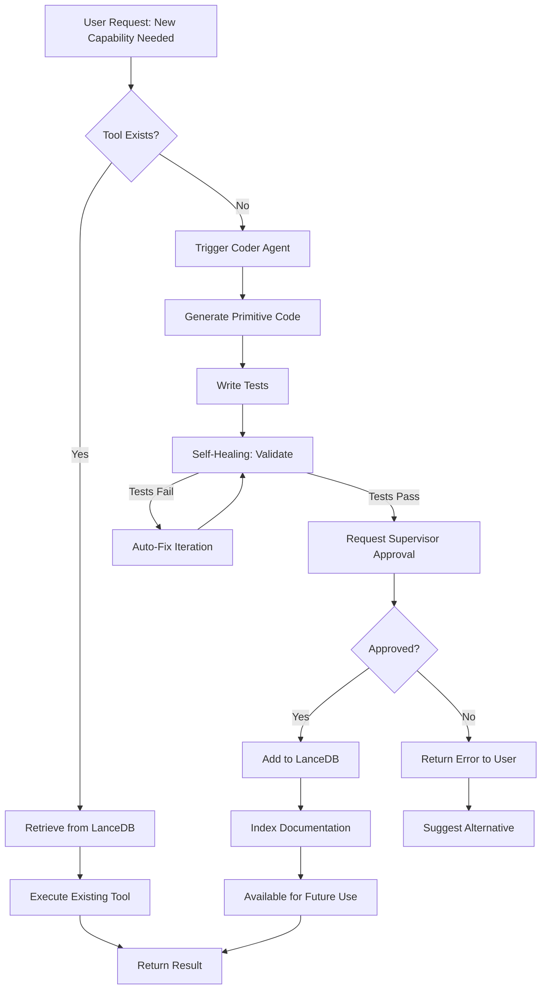
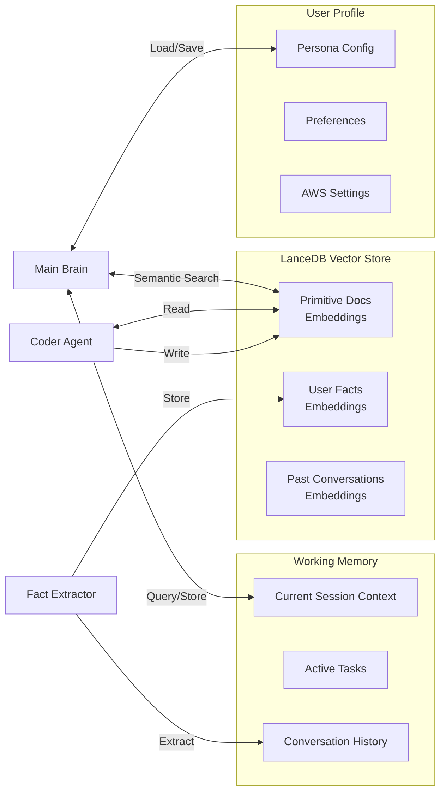
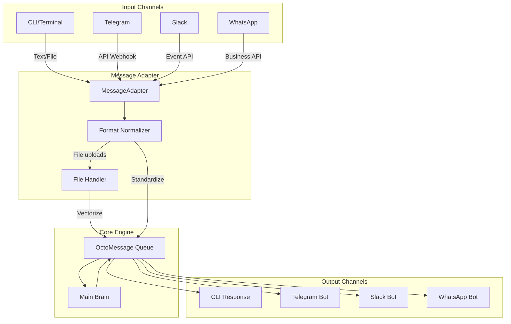
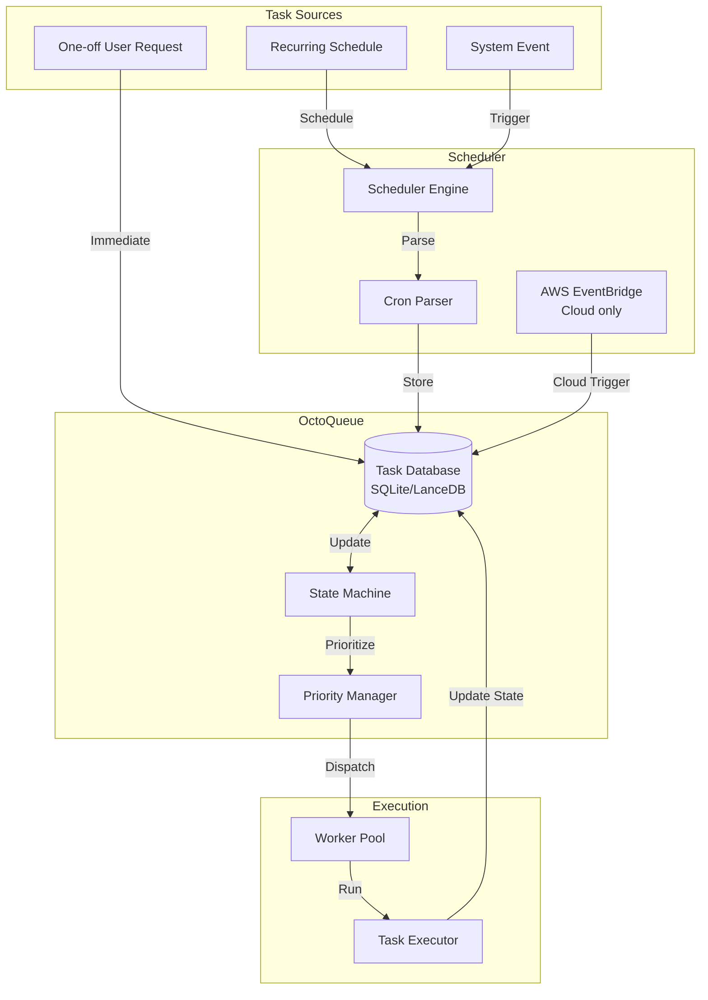
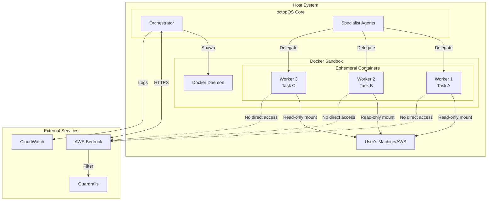

# octopOS Architecture Diagrams

## 1. Four-Tier Hierarchy Overview

## 2. Message Flow Architecture

## 3. Dynamic Tool Creation Flow

## 4. Memory Architecture

## 5. Omni-Channel Interface Architecture

## 6. Task Scheduling Architecture

## 7. Security & Isolation Model

