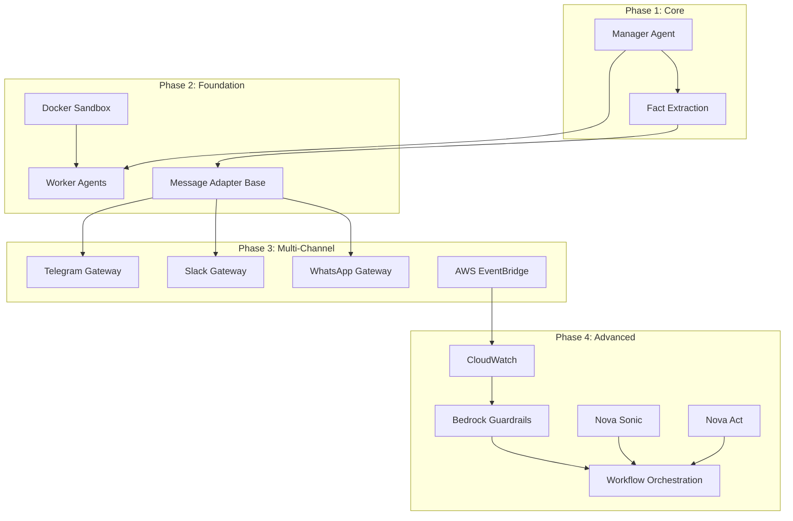
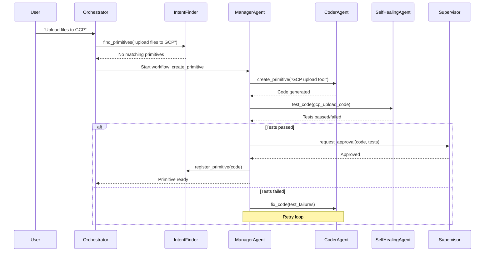
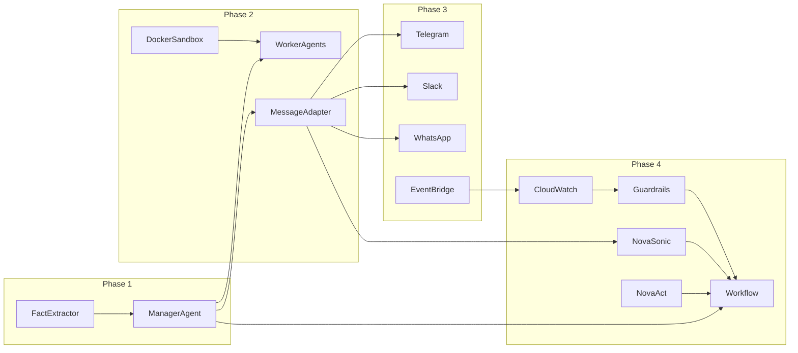

# octopOS Implementation Roadmap

## Executive Summary

This document provides a comprehensive implementation plan for all incomplete components of the octopOS Agentic Operating System. The roadmap is organized into 4 phases, from immediate priorities to advanced features.

---

## System Architecture Overview



---

## Phase 1: Immediate Priority

### 1.1 Manager Agent

**File:** [`src/specialist/manager_agent.py`](src/specialist/manager_agent.py)

**Purpose:** Coordinate data flow between specialist agents and manage agent lifecycle.

**Key Responsibilities:**
- Route messages between agents (Coder ↔ Self-Healing)
- Manage agent collaboration workflows
- Handle agent lifecycle (start, stop, restart)
- Monitor agent health and status
- Load balancing between agent instances

**Implementation Details:**

```python
# Core Components
class AgentRegistry:
    - agents: Dict[str, BaseAgent]
    - health_status: Dict[str, AgentHealth]
    - capabilities: Dict[str, List[str]]

class MessageRouter:
    - route_message(source, target, message)
    - broadcast_to_capable(capability, message)
    - get_optimal_agent(agent_type)

class WorkflowOrchestrator:
    - create_workflow(steps)
    - execute_workflow(workflow_id)
    - monitor_progress(workflow_id)

class AgentLifecycleManager:
    - start_agent(agent_type, config)
    - stop_agent(agent_id)
    - restart_agent(agent_id)
    - get_agent_status(agent_id)
```

**Integration Points:**
- Subscribes to [`OctoMessage`](src/engine/message.py:OctoMessage) protocol
- Coordinates with [`Orchestrator`](src/engine/orchestrator.py:Orchestrator)
- Manages [`CoderAgent`](src/specialist/coder_agent.py:CoderAgent) and [`SelfHealingAgent`](src/specialist/self_healing_agent.py:SelfHealingAgent)

**Workflow Example:**
```
1. Orchestrator detects tool not available
2. ManagerAgent receives "create_primitive" workflow
3. ManagerAgent:
   a. Starts/activates CoderAgent
   b. Routes task to CoderAgent
   c. Monitors for completion
   d. Receives code from CoderAgent
   e. Routes to SelfHealingAgent for testing
   f. Collects test results
   g. Routes to Supervisor for approval
   h. On approval, routes to IntentFinder for registration
4. Returns workflow result to Orchestrator
```

---

### 1.2 Fact Extraction System

**File:** [`src/engine/memory/fact_extractor.py`](src/engine/memory/fact_extractor.py)

**Purpose:** Automatically extract user facts from conversations and store them in user profile.

**Key Responsibilities:**
- LLM-based fact extraction from user messages
- Categorization: personal, professional, preference, location
- Confidence scoring (0.0 - 1.0)
- Automatic semantic memory storage
- Integration with [`PersonaManager`](src/engine/profiles/persona.py)

**Implementation Details:**

```python
# Core Components
class FactExtractor:
    - extract_facts(message: str, context: ContextSnapshot) -> List[UserFact]
    - categorize_fact(fact: str) -> FactCategory
    - score_confidence(fact: str, evidence: str) -> float
    - should_extract(message: str) -> bool

class FactCategory(Enum):
    PERSONAL = "personal"      # name, age, family
    PROFESSIONAL = "professional"  # job, company, skills
    PREFERENCE = "preference"  # likes, dislikes, favorites
    LOCATION = "location"      # city, country, timezone
    TECHNICAL = "technical"    # stack, tools, environment

class ExtractedFact:
    - type: FactCategory
    - key: str
    - value: str
    - confidence: float
    - source_message: str
    - timestamp: datetime
```

**Example Flow:**
```
1. User: "I live in Istanbul and work as a Python developer"
2. FactExtractor analyzes with LLM:
   - Extract: {type: "location", key: "city", value: "Istanbul", confidence: 0.95}
   - Extract: {type: "professional", key: "role", value: "Python developer", confidence: 0.92}
3. Facts are stored in UserProfile.facts
4. High-confidence facts added to SemanticMemory for long-term recall
5. WorkingMemory updated with current context
```

**Integration Points:**
- Uses [`UserProfile`](src/engine/profiles/persona.py:UserProfile) for storage
- Integrates with [`SemanticMemory`](src/engine/memory/semantic_memory.py) for long-term recall
- Triggers via [`WorkingMemory`](src/engine/memory/working_memory.py) conversation analysis

---

## Phase 2: Foundation Infrastructure

### 2.1 Docker Sandbox Setup

**Files:**
- `sandbox/Dockerfile` - Base sandbox image
- `sandbox/docker-compose.yml` - Local orchestration
- `sandbox/entrypoint.sh` - Container entrypoint
- `sandbox/config/security.conf` - Security policies
- `sandbox/config/limits.conf` - Resource limits

**Purpose:** Provide isolated execution environment for Worker Agents.

**Key Features:**
- Pre-installed Python 3.10+ and common tools
- Volume mounting for workspace
- Network isolation options
- Resource constraints (CPU, memory, disk)
- Security sandboxing

**Implementation Details:**

```dockerfile
# sandbox/Dockerfile
FROM python:3.11-slim

# Security hardening
RUN groupadd -r worker && useradd -r -g worker worker

# Install dependencies
RUN apt-get update && apt-get install -y \
    git \
    curl \
    && rm -rf /var/lib/apt/lists/*

# Copy entrypoint
COPY entrypoint.sh /entrypoint.sh
RUN chmod +x /entrypoint.sh

# Set up workspace
RUN mkdir -p /workspace && chown worker:worker /workspace
WORKDIR /workspace

# Run as non-root
USER worker

ENTRYPOINT ["/entrypoint.sh"]
```

```yaml
# sandbox/docker-compose.yml
version: '3.8'
services:
  worker:
    build: .
    volumes:
      - ./workspace:/workspace:rw
    network_mode: none  # Isolation
    mem_limit: 512m
    cpus: 1.0
    read_only: true
    tmpfs:
      - /tmp:noexec,nosuid,size=100m
```

---

### 2.2 Worker Agents

**Files:**
- [`src/workers/base_worker.py`](src/workers/base_worker.py) - BaseWorker class
- [`src/workers/ephemeral_container.py`](src/workers/ephemeral_container.py) - Docker container management
- [`src/workers/worker_pool.py`](src/workers/worker_pool.py) - Worker pool management

**Purpose:** Stateless, ephemeral agents that execute primitives inside Docker containers.

**Key Responsibilities:**
- Docker container lifecycle management
- Stateless execution environment
- Input/output only communication
- Automatic cleanup after task completion
- Resource limits enforcement

**Implementation Details:**

```python
# Core Components
class BaseWorker:
    - worker_id: str
    - container_id: Optional[str]
    - status: WorkerStatus
    - execute_task(task: TaskPayload) -> Dict[str, Any]
    
class EphemeralContainer:
    - create_container(image, command, volumes)
    - run_ephemeral(command, input_data, timeout)
    - cleanup_container(container_id)
    - get_logs(container_id)
    
class WorkerPool:
    - workers: Dict[str, BaseWorker]
    - max_workers: int
    - get_available_worker() -> BaseWorker
    - scale_workers(count: int)
    - cleanup_idle_workers()

class WorkerStatus(Enum):
    IDLE = "idle"
    BUSY = "busy"
    CREATING = "creating"
    DESTROYING = "destroying"
    ERROR = "error"
```

**Workflow:**
```
1. ManagerAgent receives primitive execution request
2. ManagerAgent requests Worker from WorkerPool
3. WorkerPool creates/assigns EphemeralContainer
4. EphemeralContainer:
   a. Spins up Docker container
   b. Mounts workspace volume
   c. Executes primitive code
   d. Captures stdout/stderr
   e. Returns result
   f. Destroys container
5. Result returned to ManagerAgent
6. ManagerAgent routes result to requesting agent
```

---

### 2.3 Message Adapter Base

**File:** [`src/interfaces/message_adapter.py`](src/interfaces/message_adapter.py)

**Purpose:** Unified interface for converting platform-specific messages to OctoMessage format.

**Key Responsibilities:**
- Normalize messages from different platforms (Telegram, Slack, WhatsApp)
- Handle file uploads (PDF, images, logs)
- Voice message handling (for future Nova Sonic)
- Platform-specific webhook handling

**Implementation Details:**

```python
# Core Components
class MessageAdapter(ABC):
    - platform: str
    - normalize_message(raw_message) -> OctoMessage
    - send_response(response: OctoMessage)
    - handle_file_upload(file_data) -> FileAttachment
    - handle_voice_message(voice_data) -> VoiceAttachment

class PlatformMessage:
    - user_id: str
    - message_id: str
    - content: str
    - attachments: List[Attachment]
    - timestamp: datetime
    - platform: str

class Attachment:
    - type: AttachmentType  # file, image, voice, document
    - content: bytes
    - filename: Optional[str]
    - mime_type: str

# Platform-specific adapters inherit from MessageAdapter
class TelegramAdapter(MessageAdapter)
class SlackAdapter(MessageAdapter)
class WhatsAppAdapter(MessageAdapter)
```

---

## Phase 3: Multi-Channel & Cloud

### 3.1 Telegram Gateway

**Files:**
- `src/interfaces/telegram/bot.py` - Telegram bot implementation
- `src/interfaces/telegram/message_adapter.py` - Convert Telegram messages
- `src/interfaces/telegram/webhook_handler.py` - Webhook endpoint

**Purpose:** Telegram Bot API integration for octopOS.

**Key Features:**
- Bot command handling (/start, /help, /status)
- Message receiving via webhook
- File upload support
- Inline keyboard interactions
- Group chat support

---

### 3.2 Slack Gateway

**Files:**
- `src/interfaces/slack/bot.py` - Slack bot implementation
- `src/interfaces/slack/message_adapter.py` - Convert Slack messages
- `src/interfaces/slack/slash_commands.py` - Slash command handlers
- `src/interfaces/slack/event_handler.py` - Event subscription handler

**Purpose:** Slack integration for team collaboration.

**Key Features:**
- Slack Events API
- Slash commands (/octo, /ask, /status)
- Interactive components (buttons, modals)
- File sharing
- Thread support

---

### 3.3 WhatsApp Gateway

**Files:**
- `src/interfaces/whatsapp/bot.py` - WhatsApp Business API
- `src/interfaces/whatsapp/message_adapter.py` - Convert WhatsApp messages
- `src/interfaces/whatsapp/webhook_handler.py` - Webhook handler

**Purpose:** WhatsApp Business API integration.

**Key Features:**
- Meta Business API integration
- Message templates
- Media message handling
- Status webhooks

---

### 3.4 AWS EventBridge Integration

**File:** [`src/utils/aws_eventbridge.py`](src/utils/aws_eventbridge.py)

**Purpose:** Serverless cron integration using AWS EventBridge for cloud deployments.

**Key Responsibilities:**
- EventBridge rule creation for scheduled tasks
- Lambda function invocation for octopOS tasks
- CloudWatch Events integration
- Automatic rule cleanup when tasks are cancelled
- Hybrid mode: Local scheduler for dev, EventBridge for prod

**Implementation Details:**

```python
class EventBridgeScheduler:
    - create_scheduled_rule(name, schedule_expr, target)
    - delete_rule(name)
    - list_rules()
    - invoke_lambda(function_name, payload)
    - enable_hybrid_mode(use_eventbridge: bool)
```

---

## Phase 4: Advanced Features

### 4.1 CloudWatch Integration

**File:** [`src/utils/cloudwatch_logger.py`](src/utils/cloudwatch_logger.py)

**Purpose:** AWS CloudWatch monitoring and anomaly detection.

**Key Responsibilities:**
- CloudWatch Logs integration
- Anomaly detection alerts
- Custom metrics for agent performance
- Traceability for all actions
- Log group and stream management

**Implementation Details:**

```python
class CloudWatchLogger:
    - log_message(log_group, message, level)
    - put_metric(metric_name, value, dimensions)
    - create_alarm(metric_name, threshold)
    - get_log_streams(log_group)
    - analyze_anomalies()

class AgentMetrics:
    - task_completion_time
    - error_rate
    - message_queue_depth
    - agent_health_score
```

---

### 4.2 Bedrock Guardrails Integration

**Enhancement:** [`src/utils/aws_sts.py`](src/utils/aws_sts.py)

**Purpose:** Full integration of AWS Bedrock Guardrails for content filtering.

**Current State:** Config class has guardrail_id and guardrail_version fields, but not actively used.

**Implementation Needed:**
- Integrate Guardrails into Bedrock client calls
- Content filtering for both input and output
- Topic policy enforcement
- Word filter integration
- PII detection and redaction

---

### 4.3 Nova Sonic (Voice) Integration

**Files:**
- `src/interfaces/voice/nova_sonic.py` - Nova Sonic integration
- `src/interfaces/voice/audio_handler.py` - Audio stream handling
- `src/interfaces/voice/voice_session.py` - Voice session management

**Purpose:** Speech-to-speech integration using AWS Nova Sonic model.

**Key Features:**
- Real-time speech recognition
- Text-to-speech synthesis
- Voice command processing
- Integration with MessageAdapter for voice input

---

### 4.4 Nova Act (UI/Workflow) Integration

**Files:**
- `src/interfaces/ui/nova_act.py` - Nova Act integration
- `src/interfaces/ui/automation_engine.py` - Workflow automation
- `src/interfaces/ui/screen_analysis.py` - Screen content analysis

**Purpose:** Multimodal UI and workflow automation using Nova Act.

**Key Features:**
- Web UI automation
- Screen understanding
- Workflow recording and replay
- Multimodal input processing

---

### 4.5 Complete Workflow Orchestration

**Enhancement:** Integration across multiple components

**Purpose:** Complete end-to-end workflow integration between all agents.

**Missing Workflow Steps to Implement:**
1. Main Brain → Tool Available? check via [`IntentFinder`](src/engine/memory/intent_finder.py)
2. Tool Not Available → Coder Agent workflow
3. Coder Agent → Self-Healing Agent testing loop
4. Self-Healing → Supervisor approval request
5. Supervisor approval → [`IntentFinder`](src/engine/memory/intent_finder.py) registration
6. Worker execution with anomaly detection

**Files to Enhance:**
- [`orchestrator.py`](src/engine/orchestrator.py): Add IntentFinder integration for tool checking
- [`coder_agent.py`](src/specialist/coder_agent.py): Add Self-Healing Agent trigger after code generation
- [`supervisor.py`](src/engine/supervisor.py): Add approval workflow for new primitives
- [`intent_finder.py`](src/engine/memory/intent_finder.py): Add primitive registration after approval

**Workflow Diagram:**


---

## Implementation Dependencies



---

## Testing Strategy

Each component should include:

1. **Unit Tests** - Component-level functionality
2. **Integration Tests** - Inter-component communication
3. **End-to-End Tests** - Full workflow validation
4. **Docker Tests** - Container execution verification

**Test File Pattern:**
```
tests/
├── unit/
│   ├── test_manager_agent.py
│   ├── test_fact_extractor.py
│   └── test_worker_pool.py
├── integration/
│   ├── test_agent_workflow.py
│   └── test_multi_channel.py
└── e2e/
    └── test_full_workflow.py
```

---

## Documentation Requirements

1. **API Documentation** - docstrings for all public methods
2. **Architecture Documentation** - Mermaid diagrams for workflows
3. **Integration Guides** - How to add new platforms/channels
4. **Deployment Guide** - Docker and AWS setup
5. **Troubleshooting Guide** - Common issues and solutions

---

## Success Criteria

### Phase 1
- [ ] Manager Agent can route messages between Coder and Self-Healing agents
- [ ] Fact Extraction extracts at least 3 fact categories with 90% confidence
- [ ] Integration tests pass for agent coordination

### Phase 2
- [ ] Docker Sandbox runs primitives in isolated containers
- [ ] Worker Pool manages concurrent ephemeral workers
- [ ] Message Adapter normalizes Telegram/Slack/WhatsApp to OctoMessage

### Phase 3
- [ ] Telegram Bot responds to commands and messages
- [ ] Slack integration supports slash commands
- [ ] WhatsApp webhook receives and processes messages
- [ ] EventBridge scheduler triggers tasks in cloud

### Phase 4
- [ ] CloudWatch logs all agent activities with custom metrics
- [ ] Guardrails filter harmful content in Bedrock calls
- [ ] Nova Sonic processes voice commands
- [ ] Nova Act automates UI workflows
- [ ] Complete workflow: Tool creation → Test → Approval → Registration executes end-to-end

---

## Notes

- All new code must follow existing patterns in [`base_agent.py`](src/engine/base_agent.py)
- Use [`OctoMessage`](src/engine/message.py:OctoMessage) protocol for all inter-agent communication
- Maintain type hints throughout (Python 3.10+)
- Include comprehensive docstrings
- Add logging via [`AgentLogger`](src/utils/logger.py)
- Write tests for all public methods

