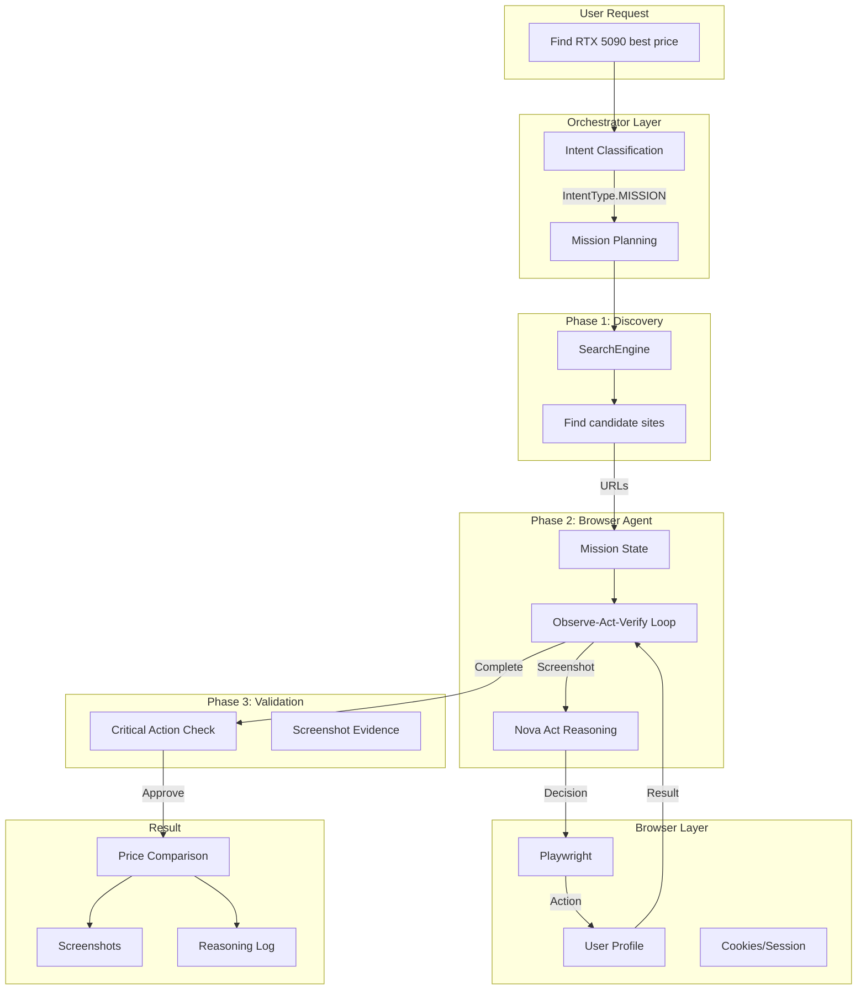

# Nova Act Mission Integration Plan

## Vision

Transform octopOS from a simple web scraper into a **Browser Agent** capable of complex, multi-step missions like "Find the best price for RTX 5090" by combining:
- **Playwright** for reliable browser automation
- **Nova Act** for intelligent decision-making and verification
- **Long-lived sessions** to maintain login states
- **Mission orchestration** for complex workflows

## Architecture Overview



## Component Breakdown

### 1. Enhanced Configuration (`src/utils/config.py`)

```yaml
browser:
  headless: false  # Set to true for production
  timeout: 30000   # 30 seconds default timeout
  viewport:
    width: 1920
    height: 1080
  
  # Session persistence
  sessions:
    profile_dir: "~/.octopos/browser_profiles"
    persist_cookies: true
    persist_local_storage: true
    default_profile: "default"
    
  # Nova Act settings
  nova_act:
    model_id: "amazon.nova-pro-v1:0"
    max_steps: 20
    screenshot_on_each_step: true
    
  # Action safety levels
  safety:
    critical_actions: ["click_purchase", "submit_form", "enter_payment"]
    require_approval: true
```

### 2. Browser Session Manager (`src/primitives/web/browser_session.py`)

```python
class BrowserSessionManager:
    """Manages persistent browser sessions with profiles."""
    
    def get_session(self, profile_name: str = "default") -> BrowserSession
    def save_session(self, session: BrowserSession)
    def close_session(self, profile_name: str)
    def get_cookies(self, profile_name: str) -> List[Dict]
    def set_cookies(self, profile_name: str, cookies: List[Dict])
```

### 3. NovaActDriver Enhanced (`src/primitives/web/nova_act_driver.py`)

```python
class NovaActDriver:
    """Enhanced browser automation with Nova Act intelligence."""
    
    # Browser control (via Playwright)
    async def navigate(self, url: str)
    async def click(self, selector: str)
    async def type(self, selector: str, text: str)
    async def scroll(self, direction: str, amount: int)
    async def select_option(self, selector: str, value: str)
    async def wait_for_element(self, selector: str, timeout: int)
    async def take_screenshot(self) -> bytes
    async def get_page_text(self) -> str
    
    # Nova Act intelligence
    async def analyze_page(self, query: str, screenshot: bytes) -> ActionDecision
    async def verify_action(self, action: str, before: bytes, after: bytes) -> bool
    async def extract_data(self, schema: Dict, screenshot: bytes) -> Dict
    
    # Session management
    async def save_state(self, profile_name: str)
    async def load_state(self, profile_name: str)
```

### 4. BrowserAgent (`src/specialist/browser_agent.py`)

```python
class BrowserAgent(BaseAgent):
    """
    Specialist agent for browser-based missions.
    
    Implements the Observe-Act-Verify loop:
    1. Observe: Take screenshot and analyze page state
    2. Plan: Use Nova Act to decide next action
    3. Act: Execute action via Playwright
    4. Verify: Confirm action succeeded
    5. Loop: Repeat until mission complete
    """
    
    async def execute_mission(self, mission: BrowserMission) -> MissionResult:
        """Execute a multi-step browser mission."""
        
        state = MissionState(mission)
        driver = NovaActDriver(profile=mission.profile)
        
        for step in range(mission.max_steps):
            # 1. Observe
            screenshot = await driver.take_screenshot()
            page_text = await driver.get_page_text()
            
            # 2. Plan with Nova Act
            decision = await self._plan_action(
                mission=mission,
                state=state,
                screenshot=screenshot,
                page_text=page_text
            )
            
            # 3. Check if mission complete
            if decision.action == "COMPLETE":
                return MissionResult(
                    success=True,
                    data=decision.extracted_data,
                    screenshots=state.screenshots,
                    reasoning_log=state.reasoning_log
                )
            
            # 4. Safety check for critical actions
            if decision.action in CRITICAL_ACTIONS:
                approved = await self._request_approval(decision)
                if not approved:
                    return MissionResult(success=False, error="Action rejected")
            
            # 5. Act
            await self._execute_action(driver, decision)
            
            # 6. Verify
            new_screenshot = await driver.take_screenshot()
            verified = await driver.verify_action(
                decision.action,
                before=screenshot,
                after=new_screenshot
            )
            
            if not verified:
                state.record_failure(decision)
                # Retry or abort logic
            else:
                state.record_success(decision, new_screenshot)
        
        return MissionResult(success=False, error="Max steps exceeded")
```

### 5. Mission Types

```python
@dataclass
class BrowserMission:
    """Definition of a browser mission."""
    goal: str  # Natural language goal
    starting_url: Optional[str]
    search_query: Optional[str]  # If we need to search first
    max_steps: int = 20
    profile: str = "default"
    require_approval: bool = True
    data_schema: Optional[Dict]  # What data to extract

# Example missions:
PRICE_COMPARISON_MISSION = BrowserMission(
    goal="Find the best price for RTX 5090",
    search_query="RTX 5090 fiyat",
    data_schema={
        "product_name": str,
        "price": float,
        "currency": str,
        "in_stock": bool,
        "seller": str,
        "shipping_cost": Optional[float]
    }
)

STOCK_TRACKING_MISSION = BrowserMission(
    goal="Check if iPhone 16 Pro is in stock on Apple Store",
    starting_url="https://www.apple.com/shop/buy-iphone",
    data_schema={
        "in_stock": bool,
        "available_models": List[str],
        "delivery_date": Optional[str]
    }
)
```

### 6. Nova Act Prompts

```python
SYSTEM_PROMPT_OBSERVE = """
You are a browser automation expert. Analyze the current webpage screenshot and decide the next action.

Current Goal: {goal}
Mission State: {state}
Available Actions:
- NAVIGATE(url): Go to a specific URL
- CLICK(selector): Click an element
- TYPE(selector, text): Type text into input
- SCROLL(direction, amount): Scroll the page
- SELECT(selector, value): Select dropdown option
- WAIT(seconds): Wait for page to load
- EXTRACT(data): Extract data and complete mission
- COMPLETE: Mission is finished

Analyze the screenshot and respond with:
{
    "reasoning": "Step-by-step thinking process",
    "action": "The action to take",
    "parameters": {},
    "expected_outcome": "What should happen after this action"
}
"""

SYSTEM_PROMPT_VERIFY = """
Compare the before and after screenshots to verify an action succeeded.

Action: {action}
Expected outcome: {expected}

Respond with:
{
    "success": true/false,
    "reasoning": "Why the action succeeded or failed",
    "next_step": "RETRY", "CONTINUE", or "ABORT"
}
"""
```

### 7. Orchestrator Integration

```python
class IntentType:
    # ... existing types ...
    MISSION = "mission"  # Complex browser-based task

class Orchestrator:
    async def process_user_input(self, input: str):
        intent = await self._classify_intent(input)
        
        if intent.type == IntentType.MISSION:
            # Create browser mission
            mission = await self._create_mission(intent)
            
            # Route to BrowserAgent
            browser_agent = self._get_browser_agent()
            result = await browser_agent.execute_mission(mission)
            
            return result
```

## Implementation Phases

### Phase A: Infrastructure (Week 1)
- [ ] Install Playwright: `pip install playwright && playwright install`
- [ ] Update config.py with browser settings
- [ ] Create BrowserSessionManager
- [ ] Implement NovaActDriver with basic actions
- [ ] Test session persistence

### Phase B: BrowserAgent Core (Week 2)
- [ ] Create BrowserAgent class
- [ ] Implement Observe-Act-Verify loop
- [ ] Create Nova Act prompts
- [ ] Add mission state tracking
- [ ] Test with simple navigation tasks

### Phase C: Mission System (Week 3)
- [ ] Define mission types and schemas
- [ ] Create mission orchestration
- [ ] Integrate with SearchEngine
- [ ] Add handoff protocols
- [ ] Implement retry and error recovery

### Phase D: Safety & UI (Week 4)
- [ ] Integrate with Supervisor for approvals
- [ ] Add screenshot capture and storage
- [ ] Create mission result visualization
- [ ] Add reasoning step logging
- [ ] Build CLI/GUI for mission monitoring

## Example: RTX 5090 Price Tracking

```python
# User input
"Kanka RTX 5090 en ucuz nerede bak bakalım"

# Step 1: Orchestrator recognizes MISSION intent
# Step 2: SearchEngine finds candidate sites (Akakçe, Amazon, İtopya)
# Step 3: BrowserAgent executes mission:

MISSION_LOG = [
    {
        "step": 1,
        "action": "NAVIGATE",
        "url": "https://www.akakce.com",
        "reasoning": "Starting with Akakçe as it's a price comparison site",
        "screenshot": "step1_akakce_home.png"
    },
    {
        "step": 2,
        "action": "TYPE",
        "selector": "#search-input",
        "text": "RTX 5090",
        "reasoning": "Need to search for the product",
        "screenshot": "step2_search_typed.png"
    },
    {
        "step": 3,
        "action": "CLICK",
        "selector": "#search-button",
        "reasoning": "Submit the search",
        "screenshot": "step3_results.png"
    },
    {
        "step": 4,
        "action": "EXTRACT",
        "data": {
            "seller": "İtopya",
            "price": 68000,
            "currency": "TRY",
            "in_stock": True
        },
        "reasoning": "Found İtopya listing with price 68,000 TL",
        "screenshot": "step4_itopya_price.png"
    },
    # ... continues to other sites ...
    {
        "step": 10,
        "action": "COMPLETE",
        "reasoning": "Compared all 3 sites. İtopya has best price.",
        "result": {
            "winner": "İtopya",
            "price": "68,000 TL",
            "shipping": "100 TL",
            "evidence": "screenshot_step4_itopya_price.png"
        }
    }
]

# Final result to user:
"""
Kanka en iyisi İtopya'da buldum! 💰

🥇 İtopya: 68,000 TL + 100 TL kargo
🥈 Amazon: 72,000 TL (ücretsiz kargo)
🥉 Akakçe: 75,000 TL

İşte kanıtı: [Screenshot showing price]

Tam karşılaştırma için: /mission/rtx5090_comparison
"""
```

## Success Metrics

- **Task Completion Rate**: >90% for simple missions (< 5 steps)
- **Accuracy**: Price data 100% accurate (verified via screenshots)
- **Speed**: Complete price comparison in < 2 minutes
- **Safety**: 0 unauthorized critical actions (purchases, etc.)

## Next Steps

Ready to implement Phase A! Shall I proceed with:
1. Installing Playwright and setting up browser infrastructure
2. Creating the BrowserSessionManager
3. Building the enhanced NovaActDriver

Or would you like to review/adjust the architecture first?