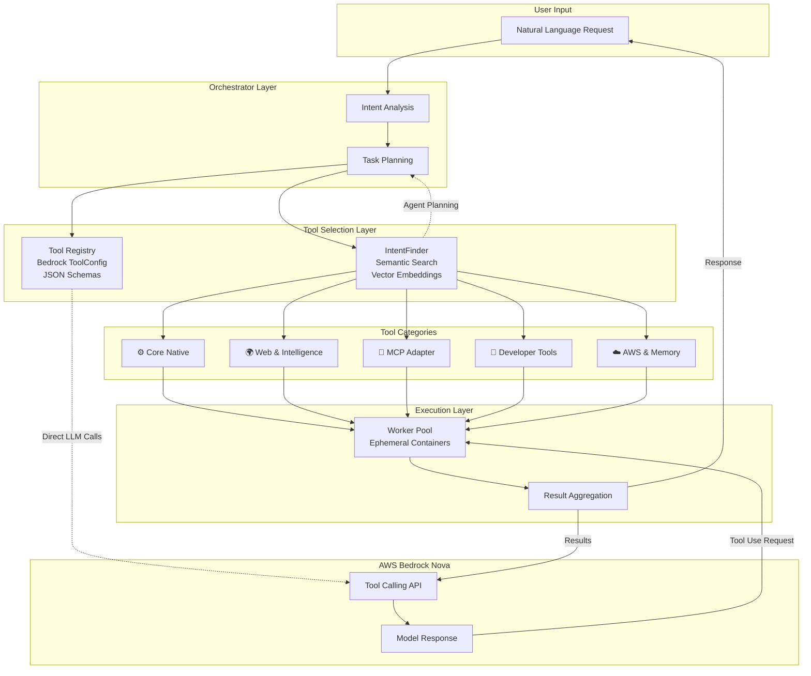
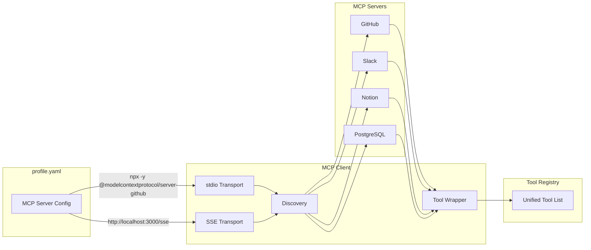

# octopOS Tool/Primitive Library Architecture

## Vision

A comprehensive "Alet Çantası" (Tool Library) that transforms octopOS from a text-generating assistant into a full-fledged cyber assistant capable of taking action on behalf of the user. This architecture integrates with AWS Bedrock Nova models' "Tool Calling" capabilities while maintaining the existing semantic tool selection (IntentFinder).

## Architecture Overview



## Key Architectural Decisions

### 1. Parallel Systems: IntentFinder + Bedrock Tool Calling

| System | Purpose | When Used |
|--------|---------|-----------|
| **IntentFinder** | Semantic tool selection via vector embeddings | Agent-level planning, complex multi-step workflows, tool discovery |
| **Bedrock Tool Calling** | Native LLM tool use with toolConfig schemas | Direct LLM interactions, single-turn tool execution, precise control |

**Benefits:**
- IntentFinder provides fuzzy matching and semantic understanding
- Bedrock Tool Calling provides deterministic, schema-validated execution
- Both systems share the same primitive registry

### 2. Tool Registry Architecture

The `ToolRegistry` serves as the single source of truth:

```python
class ToolRegistry:
    """Unified registry for all primitives and tools."""
    
    # Internal storage
    _primitives: Dict[str, BasePrimitive]
    _mcp_tools: Dict[str, MCPTool]
    
    # Conversion methods
    def to_bedrock_tool_config(self) -> List[Dict]: ...
    def to_intent_finder_schema(self) -> List[Dict]: ...
```

### 3. MCP Integration ("Baş tacı" - Crown Jewel)

Full MCP protocol support with:
- **Transports**: stdio (local processes), SSE (HTTP server-sent events)
- **Capabilities**: Tools, Resources, Prompts
- **Dynamic Discovery**: Auto-register MCP server tools on connection
- **Configuration**: Via `profile.yaml` MCP server entries

### 4. Folder Structure

```
src/primitives/
├── __init__.py
├── base_primitive.py          # Base class (existing)
├── tool_registry.py           # Unified registry + Bedrock schema generation
│
├── native/                    # ⚙️ Core Native
│   ├── __init__.py
│   ├── bash_executor.py       # Docker sandbox command execution
│   ├── file_search.py         # Regex/grep file search
│   └── file_editor.py         # Diff/patch file editing
│
├── web/                       # 🌍 Web & Intelligence
│   ├── __init__.py
│   ├── search_engine.py       # Brave API + DuckDuckGo fallback
│   ├── nova_act_scraper.py    # AWS Nova Act for JS-rendered sites
│   └── public_api_caller.py   # Curated public APIs
│
├── mcp_adapter/               # 🔌 MCP Integration
│   ├── __init__.py
│   ├── mcp_client.py          # MCP client with stdio/SSE
│   ├── mcp_transport.py       # Transport abstractions
│   ├── mcp_discovery.py       # Tool discovery from servers
│   └── mcp_tool_wrapper.py    # Wrap MCP tools as primitives
│
├── dev/                       # 🧠 Developer Tools
│   ├── __init__.py
│   ├── ast_parser.py          # Abstract Syntax Tree parsing
│   └── git_manipulator.py     # Git operations
│
└── cloud_aws/                 # ☁️ AWS & Memory
    ├── __init__.py
    ├── s3_manager.py          # S3 operations (from existing)
    ├── dynamodb_client.py     # DynamoDB operations (from existing)
    ├── cloudwatch_inspector.py # Log analysis and anomalies
    └── bedrock_invoker.py     # Bedrock model invocation (from existing)
```

## Tool Categories Detailed Design

### 1. ⚙️ Core Native

**bash_executor**
- Executes commands in Docker sandbox or approved local paths
- Uses existing EphemeralContainer infrastructure
- Security: Command allowlisting, timeout enforcement, output sanitization

**file_search**
- Regex and glob-based file/directory search
- Grep-like content search within files
- Returns file metadata and match locations

**file_editor**
- Precise file modifications using diff/patch logic
- Never uses sed/cat hacks
- Supports line-range updates, insertions, deletions
- Validates changes before applying

### 2. 🌍 Web & Intelligence

**search_engine**
- Primary: Brave Search API (requires API key)
- Fallback: DuckDuckGo (anonymous) or Tavily
- Returns top 5 results with title, URL, snippet

**nova_act_scraper**
- Uses AWS Nova Act multimodal model
- Handles JavaScript-rendered sites
- Extracts clean data from complex UIs (HackerNews, X, e-commerce)
- Screenshots + DOM understanding

**public_api_caller**
- Curated list from GitHub public-apis repository
- Pre-defined schemas for popular APIs
- Dynamic endpoint construction
- Rate limiting and caching

### 3. 🔌 MCP Adapter

**MCP Client Architecture**



### 4. 🧠 Developer Tools

**ast_parser**
- Python AST parsing for code understanding
- Extracts: class hierarchies, function signatures, imports
- Answers: "Which object inherits from where?", "What are the API parameters?"
- Avoids loading entire codebase into LLM context

**git_manipulator**
- Git operations: status, diff, commit, push, pull
- Branch management
- Change tracking for agent operations

### 5. ☁️ AWS & Memory

**cloudwatch_inspector**
- Log group and stream querying
- Pattern matching for anomalies
- Metric retrieval and alerting
- Integration with Self-Healing Agent

**semantic_retriever**
- LanceDB vector search integration
- User preference retrieval ("You usually prefer Svelte over React")
- Error solution recall from memory
- Context injection for coding tasks

## Bedrock ToolConfig Schema Generation

The `ToolRegistry` automatically generates Bedrock-compatible tool configurations:

```python
{
    "toolSpec": {
        "name": "file_search",
        "description": "Search for files using regex or glob patterns",
        "inputSchema": {
            "json": {
                "type": "object",
                "properties": {
                    "pattern": {
                        "type": "string",
                        "description": "Search pattern (regex or glob)"
                    },
                    "path": {
                        "type": "string",
                        "description": "Directory to search in"
                    }
                },
                "required": ["pattern"]
            }
        }
    }
}
```

## Integration with Existing Components

### Orchestrator Integration

1. User input received
2. IntentFinder suggests relevant primitives (semantic match)
3. Orchestrator constructs Bedrock ToolConfig from suggestions
4. LLM decides which tools to use
5. ToolRegistry routes execution to appropriate primitive
6. Results returned to LLM for final response

### Coder Agent Integration

- Uses file_editor for code modifications
- Uses ast_parser for project understanding
- Uses git_manipulator for version control
- New primitives registered via IntentFinder after approval

### Self-Healing Agent Integration

- Uses cloudwatch_inspector for log analysis
- Uses bash_executor for diagnostic commands
- Uses file_editor for configuration fixes

## Implementation Phases

### Phase 1: Core Foundation (Weeks 1-2)
- Refactor primitives into categorized folders
- Implement bash_executor with sandbox integration
- Implement file_search and file_editor
- Create ToolRegistry with Bedrock schema generation

### Phase 2: Web & Intelligence (Weeks 3-4)
- Implement search_engine with fallback chain
- Implement public_api_caller with curated APIs
- Enhance nova_act_scraper integration

### Phase 3: MCP Integration (Weeks 5-6)
- Implement MCP client with stdio/SSE transports
- Implement tool discovery and dynamic registration
- Create MCP tool wrapper for primitive interface

### Phase 4: Developer Tools (Weeks 7-8)
- Implement ast_parser
- Implement git_manipulator
- Integration testing with Coder Agent

### Phase 5: AWS & Memory (Weeks 9-10)
- Implement cloudwatch_inspector
- Enhance semantic_retriever
- Full integration testing

## Dependencies to Add

```toml
[project.dependencies]
# Web & Scraping
httpx = ">=0.25.0"
beautifulsoup4 = ">=4.12.0"
playwright = ">=1.40.0"  # For Nova Act fallback

# MCP
mcp = ">=1.0.0"  # Official MCP SDK

# AST & Code Analysis
ast-decompiler = ">=0.7.0"
GitPython = ">=3.1.0"

# Search APIs
duckduckgo-search = ">=3.9.0"
```

## Configuration

### profile.yaml MCP Section

```yaml
mcp:
  servers:
    github:
      command: "npx"
      args: ["-y", "@modelcontextprotocol/server-github"]
      env:
        GITHUB_TOKEN: ${GITHUB_TOKEN}
    
    slack:
      command: "npx"
      args: ["-y", "@modelcontextprotocol/server-slack"]
      env:
        SLACK_TOKEN: ${SLACK_TOKEN}
    
    custom_api:
      url: "http://localhost:3000/sse"
      headers:
        Authorization: "Bearer ${API_TOKEN}"
```

## Security Considerations

1. **bash_executor**: Command allowlisting, timeout enforcement, network isolation
2. **file_editor**: Path validation, backup creation, change review
3. **MCP**: Server verification, permission scopes, audit logging
4. **public_api_caller**: Rate limiting, response sanitization

## Success Metrics

- Tool execution success rate > 95%
- Average tool discovery time < 100ms (IntentFinder)
- MCP server connection success rate > 98%
- Bedrock Tool Calling latency < 500ms
- New primitive registration time < 30s
